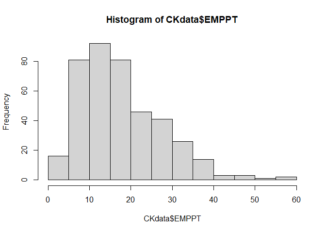
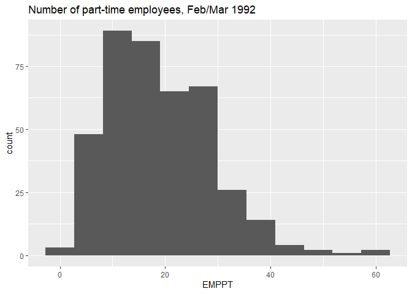
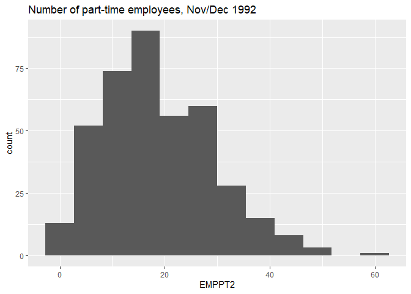
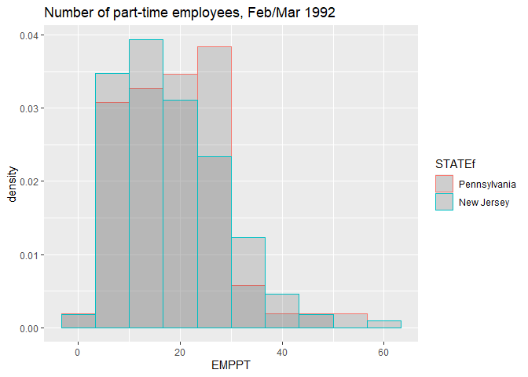
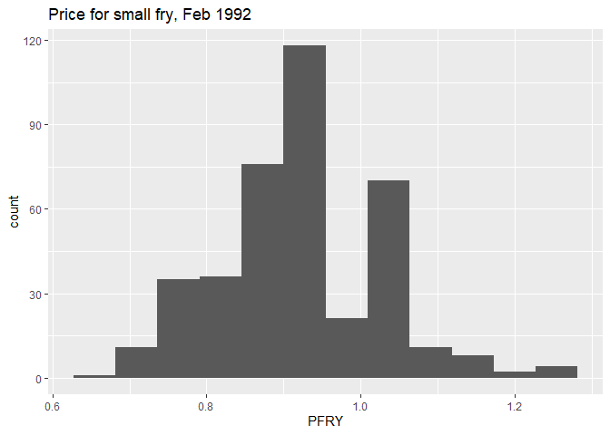

# Introduction

We continue to use the same data as in Comp_Lab0. So you may want to continue working in the same script file you created last week and add commands to that file. The last thing we did in the previous lab is that we turned the `CHAIN` and `STORE` variables into factor variables, `CHAINf` and `STOREf`. We will use these variables in some of the work following. So the minimum code you need from last week is the loading of the libraries, the import of the data and the creation of the two factor variables `CHAINf` and `STOREf`. But of course it is best to just continue in the script file you created for the previous computer lab.


# Learning Outcomes

This computer lab is for you 

* to explore calculate some basic summary statistics
* to create some graphical data representations
* Calculate summary statistics conditional on group membership
* Estimate a simple diff-in-diff estimator

Also check out the [ECLR](https://datasquad.github.io/ECLR) website which has sections which cover this material as well.

# Some summary statistics

Whenever you deal with real life data you should ensure that you understand the data characteristics. The easiest way to get a first impression of your data is to create some summary statistics, here for instance for the `EMPFT` variable (number of full-time employees before the change in the minimum wage)


``` r
summary(CKdata$EMPFT)
```

```
##    Min. 1st Qu.  Median    Mean 3rd Qu.    Max.    NA's 
##   0.000   2.000   6.000   8.203  12.000  60.000       6
```

We can see that, on average, the restaurants employed 8.2 full-time staff. The largest restaurant had 60 full-time staff members.

We can also look at several variables together. Try and run the command below. It has two mistakes. But before you try and fix it, run it as it is so that you can see the error messages and try and use them to figure out what is wrong.

You will constantly have to deal with error messages and that is totally normal. Please attempt to run this code before actually attempting to fix it. It is good to get used to seeing error messages.


``` r
sumary(CKdata[c("EMPPT","EMPPT2"))
```

Once you see an error message, your inner Sherlok Holmes needs to come out! Here there is sufficient information in the error message to perhaps see that the problem lies with the parenthesis! (Hint: you need as many opening as closing, and of the same type). And once you fixed that you will find a second mistake.

Here we used a selection technique we've seen earlier, calling variables from a list (`c("EMPPT","EMPPT2")`). Once you fixed the mistakes you should get the following output:


```
##      EMPPT           EMPPT2     
##  Min.   : 0.00   Min.   : 0.00  
##  1st Qu.:11.00   1st Qu.:11.00  
##  Median :17.00   Median :17.00  
##  Mean   :18.83   Mean   :18.68  
##  3rd Qu.:25.00   3rd Qu.:25.00  
##  Max.   :60.00   Max.   :60.00  
##  NA's   :4       NA's   :10
```

We learn that the average number of part-time employees hardly changed during 1992 (check the codebook to understand what these two variables are).

We could also look at the summary statistics for the `CHAIN` variable.


``` r
summary(CKdata$CHAIN)
```

```
##    Min. 1st Qu.  Median    Mean 3rd Qu.    Max. 
##   1.000   1.000   2.000   2.117   3.000   4.000
```

We know that the `CHAIN` variable tells us something about which restaurant we are looking at. This is a categorical variable and means and standard deviation don't really make too much sense here, which is why we created the `CHAINf` variable.

When looking at categorical variables we are interested in the frequency or proportion of observations in each category. You could either use again the `summary` function (R automatically detects that the variable is a factor variable and adjusts the output to a frequency table) or the `table` function. It important to understand that the same thing can often be achieved in different ways.


``` r
summary(CKdata$CHAINf)
```

```
## Burger King         KFC  Roy Rogers     Wendy's 
##         171          80          99          60
```

``` r
table(CKdata$CHAINf)
```

```
## 
## Burger King         KFC  Roy Rogers     Wendy's 
##         171          80          99          60
```

Or the table with proportions.


``` r
prop.table(table(CKdata$CHAINf))
```

```
## 
## Burger King         KFC  Roy Rogers     Wendy's 
##   0.4170732   0.1951220   0.2414634   0.1463415
```

We fed the result of the `table` function straight into the `prop.table` function which translates frequencies into proportions.

All these data are identical to those in the Card and Krueger paper.

Now we replicate some of the summary statistics in Table 2 of the paper. We use the same functions as above, but now we feed two categorical variables into the `table` function. The addition of the `margin = 2` option ensures that proportions are calculated by state (2=columns). Try for yourself what changes if you either set `margin = 1` (1 for rows) or leave this option out.


``` r
prop.table(table(CKdata$CHAINf,CKdata$STATEf,dnn = c("Chain", "State")),margin = 2)
```

```
##              State
## Chain         Pennsylvania New Jersey
##   Burger King    0.4430380  0.4108761
##   KFC            0.1518987  0.2054381
##   Roy Rogers     0.2151899  0.2477341
##   Wendy's        0.1898734  0.1359517
```

Also google ("R table dnn") or use the help function (`?table`) to figure out what the `dnn` optional input into the table function achieves.

Now you should create a frequency and then a proportions table for the variables `CO_OWNED` and `CHAINf`. For the proportions table calculate the proportions over the outcomes of `CHAINf`. You should find that there are 44 KFC restaurants which are not co-owned (`CO_OWNED = 0`) and that 14.6 percent of all Burger King stores are co-owned.


Are there significant differences between the different chains in terms of their ownership models? Which chain has the highest proportion of co-owned stores? 

# Graphical Data Representation

Histograms are an extremely useful representation of categorical data and numerical data. Here we will look at the distribution of PT employee numbers. The simplest way to create a simple histogram is by using the `hist` function.


``` r
hist(CKdata$EMPPT)
```

<!-- -->

You can clearly see the regularity in this plot.

Let's introduce a different way to produce these plots. The function we use here is the `ggplot` function. That function is incredibly flexible as we will see in a moment. And that added flexibility is potentially worth the extra complication. So let's check it out.


``` r
ggplot(CKdata,aes(x=EMPPT)) + 
    geom_histogram(bins = 12) +
    ggtitle("Number of part-time employees, Feb/Mar 1992")
```

<!-- -->

How this function works is as follows.

* Call the `ggplot` function
* Tell `ggplot` where it should get the data from, `ggplot(CKdata)`
* Then we set the aesthetics (`aes`), here we specify that we want `EMPPT` on the x-axis, `ggplot(CKdata,aes(x=EMPPT))`

At this stage no graph is plotted. All we have done is to tell R where to get the data from and what variable it should use on the x-axis. We are yet to tell R what type of graph we should produce for the `CKdata$EMPPT` data. We do this by

* adding the instruction to produce a histogram with 12 bins `+ geom_histogram(bins = 12)`

As we want a nice title we the also

* add the instruction to give our graph a useful title, `+ ggtitle("Number of part-time employees, Feb/Mar 1992")`.

One of the very useful features of the `ggplot` function is that you can keep adding extra flourishes in a similar manner.

Now practice by creating a similar histogram for `EMPPT2`.


``` r
XXXX(XXXX,aes(x=XXXX)) + 
    geom_XXXX(bins = XXXX) +
    ggtitle("Number of part-time employees, XXXX 1992")
```

<!-- -->

To illustrate how powerful this function can be run the following command.


``` r
ggplot(CKdata,aes(EMPPT, colour = STATEf)) + 
    geom_histogram(position="identity", 
                   aes(y = ..density..),
                   bins = 10,
                   alpha = 0.2) +
    ggtitle(paste("Number of part-time employees, Feb/Mar 1992"))
```

<!-- -->

So, what happened here. We took the part-time employee data but split them into the two states (using the `colour = STATEf` option in the aesthetics).

Not everything in this command is super intuitive. In fact you should expect that you need to google (something like "R ggplot histogram two variables") to find someone who achieved what you wanted and then you nick and adjust their code! **This is super important. You will hardly ever need to know commands by heart. You can usually find help fairly easily.**

Try to change a few things in the above code to see what different elements in the code do. When you do this remember, you cannot break the computer!!!!!

The variable `PFRY` represents the price of a small portion of fries in a particular store before the policy change. Calculate a histogram for that price.

<!-- -->

Now you should create histograms for the prices but separated by the different stores, i.e one histogram for Burger King, another for Wendy's and so forth. Overlay them as in the previous example. Replace the `XXXX` and identify three further small mistakes in the code below.


``` r
ggplot(CKdata,as(XXXX, colour = XXXX))  
    geom_histogram(position="identity", 
                   aes(y = ..density..),
                   bins = 10
                   alpha = 0.2) +
    ggtitle(paste("Price of fries for different stores"))
```

<!-- -->

You can perhaps already see that the type of diagram which worked very well for two categories, doesn't work so well for four categories any more. However, looking at these histograms, which of the stores has, on average the highest price?

# Summary statistics by groups

From the above histograms we suspect that the average price of fries is different for different store types. Let's investigate this further.


``` r
table2 <- CKdata %>%  group_by(CHAINf) %>% 
  summarise(avg.pfry = mean(PFRY,na.rm = TRUE)) %>%  print()
```

```
## # A tibble: 4 × 2
##   CHAINf      avg.pfry
##   <fct>          <dbl>
## 1 Burger King    0.919
## 2 KFC            0.866
## 3 Roy Rogers     1.00 
## 4 Wendy's        0.878
```

If you do not remember what the role of `na.rm = TRUE` in the above code was, first re-run the code without that part. Do you get an error message or results which are not what you expect. Search the internet or check the help function (`?mean`) to figure out what this bit of the code does.

Add another column to this table in which you report the average price of a small portion of fries after the increase of the minimum wage (`PFRY2`). You should find that the average price in KFC stores after the minimum wage introduction was 0.873.


``` r
table2 <- CKdata %>%  group_by(CHAINf) %>% 
  summarise(pfry_FEB = mean(PFRY,na.rm = TRUE),
            pfry_DEC = XXXX) %>%  print()
```


# Simple Diff-in-Diff estimator

You may wonder whether the introduction of the increased minimum wage in New Jersey increased the price of goods sold. Let's calculate the average price of a small portion of fries in PA and NJ before and after the increase of the minimum wage in NJ.

Look at the code used for the Lecture in week 1. You should be able to copy and paste a relevant piece of code from there and adjust it to give you the result here. Alternatively you adjust the code you wrote to produce the previous table. You should find that the average price in PA in December (after the introduction of the increased minimum wage in NJ) was $0.86.


Is there evidence that, in New Jersey, customers had to pay more for their fries as a result of the introduction of the minimum wage? What is the diff-in-diff estimator?


