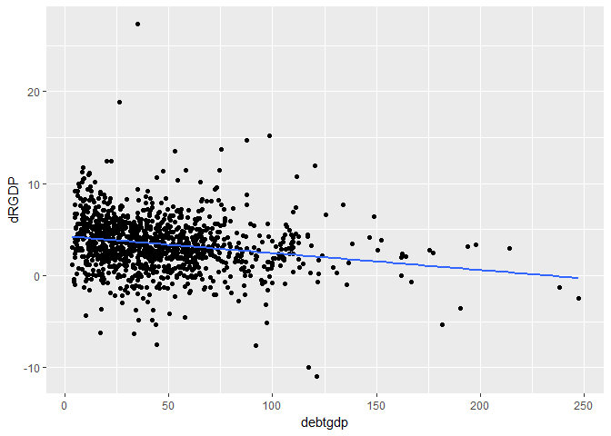
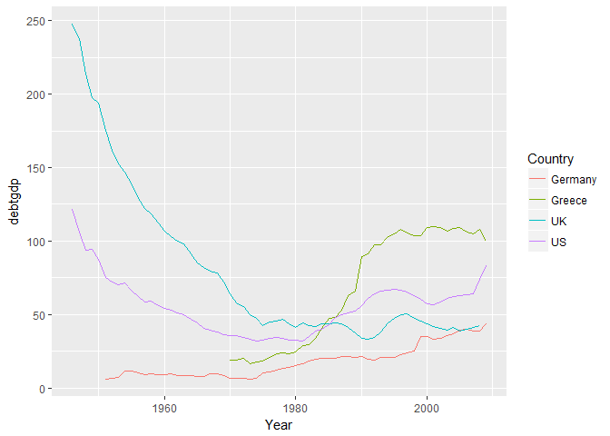
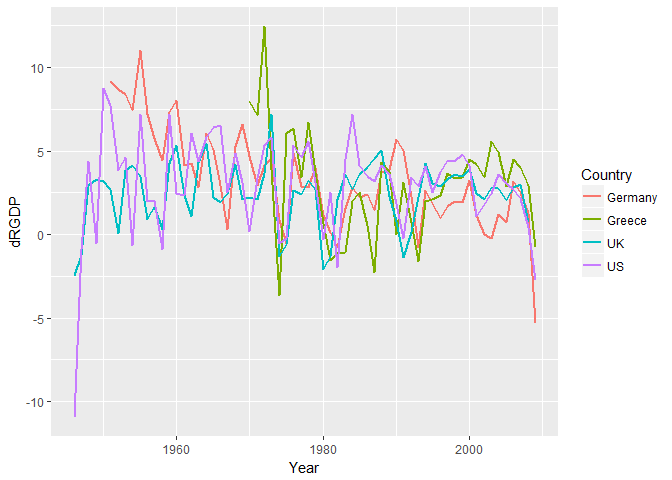
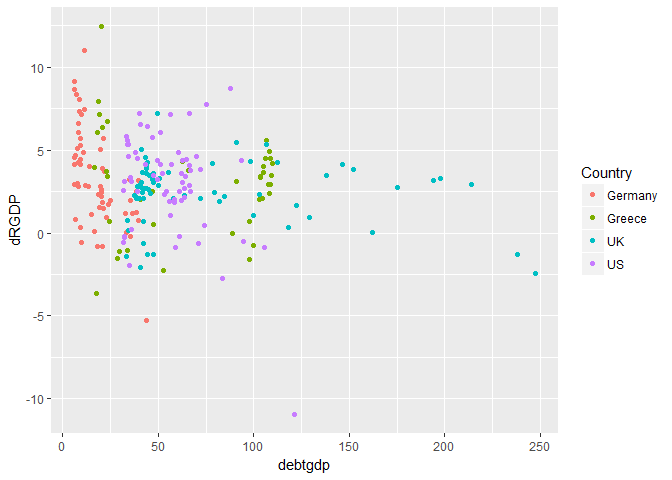

# Preparing your workfile

R is a powerful software for statistical analysis. It is open source and hence FREE software. It is constantly developped and functionality is being improved. The "price" we pay for this is that we have to do a little more set-up work to make it work.

In particular we need packages which are provided for free by researchers/programmers that provide useful functionality.

But we add libraries which enhance its capabilities. 


```r
library(tidyverse)    # for almost all data handling tasks
```

```
## Warning: package 'tidyverse' was built under R version 3.5.1
```

```
## -- Attaching packages -------------------------------------------------------------------------------- tidyverse 1.2.1 --
```

```
## v ggplot2 2.2.1     v purrr   0.2.4
## v tibble  1.4.2     v dplyr   0.7.4
## v tidyr   0.8.0     v stringr 1.3.0
## v readr   1.1.1     v forcats 0.3.0
```

```
## -- Conflicts ----------------------------------------------------------------------------------- tidyverse_conflicts() --
## x dplyr::filter() masks stats::filter()
## x dplyr::lag()    masks stats::lag()
```

```r
library(readxl)       # to import Excel data
```

```
## Warning: package 'readxl' was built under R version 3.5.1
```

```r
library(ggplot2)      # to produce nice graphiscs
library(stargazer)    # to produce nice results tables
```

```
## 
## Please cite as:
```

```
##  Hlavac, Marek (2018). stargazer: Well-Formatted Regression and Summary Statistics Tables.
```

```
##  R package version 5.2.2. https://CRAN.R-project.org/package=stargazer
```


# Introduction

Here we use an example which, at the time, made a lot of waves.  Carmen Reinhart and Kenneth Rogoff (2010) wrote work that attempted to examine the [relationship between Debt to GDP levels and GDP growth](https://scholar.harvard.edu/files/rogoff/files/growth_in_time_debt_aer.pdf). Their general conclusion was that, as long as the debt to GDP ration does not exceed 90% there seems to be no clear relationship between the two. However, countries eunning higher debt to GDP ratios are paying a sizeable growth penalty.

The empirical work of Reinhard and Rogoff was critised on three aspects by Thomas Herndon, Michael Ash and Robert Pollin. This work was published in the [Cambridge Journal of Economics in 2014](https://academic.oup.com/cje/article-abstract/38/2/257/1714018?redirectedFrom=fulltext) and previous to that as a working paper. The [working paper's website](https://www.peri.umass.edu/publication/item/526-does-high-public-debt-consistently-stifle-economic-growth-a-critique-of-reinhart-and-rogoff) also contains all the relevant data and code.

# How to learn R

Learning any programming language, and yes, that is what R essentially is, can only be done by doing. Here we are not exposing you to a bottom-up introduction of R, but we are immediately exposing you to the exciting possibilities of R and the beauty and excitement of working with real-life data. As we do so we expose you to the basic tools of working with data in R and help you to learn these.

However, you have to accept from the outset that this is going to be a bumby raod! The most crucial skill you will have to embrace and develop is that of finding solutions to prolems. You will, as any programmer, yes, even the most experienced ones, search the internet for solutions to your problem. Don't think that you can remember all the important commands from the top of your mind.

Whenever we introduce a new R functionality we will briefly explain it, but importantly we will also give you links to further resources where you can find more usage examples and details. Also do not frget to use the build-in help function in R (type `?FUNCTIONNAME` into the Console and press Enter). This is important as it is the help that will be available offline as well.

# R programming concepts used

The following R programming concepts were used in this document. The links lead to pages that provide help with these issues.

* use of packages/libraries: [ECLR](http://eclr.humanities.manchester.ac.uk/index.php/R_Packages)
* importing of data: [csv.read](http://eclr.humanities.manchester.ac.uk/index.php/R_Data), [read_excel](https://www.datacamp.com/community/tutorials/r-tutorial-read-excel-into-r)
* Summarising data: [descriptive statistics](http://eclr.humanities.manchester.ac.uk/index.php/R_Analysis#Summary_Statistics_-_Take_1)
* Plotting data using ggplot: [Cookbook for R](http://www.cookbook-r.com/Graphs/), [free 1st chapter of datacamp interactive tutorial](https://www.datacamp.com/courses/data-visualization-with-ggplot2-1)
* running regressions: [ECLR](http://eclr.humanities.manchester.ac.uk/index.php/R_Regression)
* using the [stargazer package](https://www.jakeruss.com/cheatsheets/stargazer/) for summary statistics and regresison output 
* using the tidverse to produce [subsets and groupings of data and summarise these](http://eclr.humanities.manchester.ac.uk/index.php/R_AnalysisTidy)
* hypothesis tests on sample means, using the [t.test function](https://www.statmethods.net/stats/ttest.html)

# Importing Data

This is a simplified spreadsheet (based on the work of Herndon et al.)


```r
RRData <- read_excel("RRdata.xlsx")
RRData <- as.data.frame(RRData)
str(RRData)  # prints some basic info on variables
```

```
## 'data.frame':	1171 obs. of  4 variables:
##  $ Year   : num  1946 1947 1948 1949 1950 ...
##  $ Country: chr  "Australia" "Australia" "Australia" "Australia" ...
##  $ debtgdp: num  190 177 149 126 110 ...
##  $ dRGDP  : num  -3.56 2.46 6.44 6.61 6.92 ...
```

We can see that three variables are numeric (`num`) variables which is as we expect. The fourth variable `Country` is labeled as a character (`chr`) variable, basically text. It will pay off for later to indicate to R that this is a categorical (nominal) variable. This is done as follows:


```r
RRData$Country <- as.factor(RRData$Country)
str(RRData)
```

```
## 'data.frame':	1171 obs. of  4 variables:
##  $ Year   : num  1946 1947 1948 1949 1950 ...
##  $ Country: Factor w/ 20 levels "Australia","Austria",..: 1 1 1 1 1 1 1 1 1 1 ...
##  $ debtgdp: num  190 177 149 126 110 ...
##  $ dRGDP  : num  -3.56 2.46 6.44 6.61 6.92 ...
```

There are 1171 country-year observations. In the dataset are data from 20 countries:


```r
unique(RRData$Country)
```

```
##  [1] Australia   Austria     Belgium     Canada      Denmark    
##  [6] Finland     France      Germany     Greece      Ireland    
## [11] Italy       Japan       Netherlands New Zealand Norway     
## [16] Portugal    Spain       Sweden      UK          US         
## 20 Levels: Australia Austria Belgium Canada Denmark Finland ... US
```

And data from 1946 to 2009.


```r
summary(RRData$Year)
```

```
##    Min. 1st Qu.  Median    Mean 3rd Qu.    Max. 
##    1946    1964    1980    1979    1995    2009
```

`debtgdp` is the debt to GDP ratio


```r
summary(RRData$debtgdp)
```

```
##    Min. 1st Qu.  Median    Mean 3rd Qu.    Max. 
##   3.279  22.148  40.401  46.283  61.474 247.482
```

`dRGDP` is GDP growth rate


```r
summary(RRData$dRGDP)
```

```
##    Min. 1st Qu.  Median    Mean 3rd Qu.    Max. 
## -10.942   1.911   3.283   3.430   5.100  27.329
```

The typical `summary` output does not include two pieces of info which we would often like to see, the number of observations and the standard deviation. To the rescue comes the `stargazer` package.


```r
stargazer(RRData,type="text") # other types available: "latex", "html"
```

```
## 
## ====================================================================
## Statistic   N     Mean    St. Dev.   Min   Pctl(25) Pctl(75)   Max  
## --------------------------------------------------------------------
## Year      1,171 1,979.155  17.944   1,946   1,964    1,995    2,009 
## debtgdp   1,171  46.283    32.395   3.279   22.148   61.474  247.482
## dRGDP     1,171   3.430    2.981   -10.942  1.911    5.100   27.329 
## --------------------------------------------------------------------
```


# An initial basic data plots

Let's have a look at some of the data. We will first look at a scatterplot (using the amazing `ggplot` library).


```r
ggplot(RRData,aes(x=debtgdp,y=dRGDP)) +
  geom_point() +    # this produces the scatter plot
  geom_smooth(method = "lm", se = FALSE)  # this adds the linear line of best fit
```

<!-- -->

Note a few points about how this graph is being called. `ggplot(RRData,aes(debtgdp,dRGDP))` Sets up the graph. The first input (`RRData`) tells R which data to use. In the `aes()` section (`aes` for aesthetics) we determine which variable should appear on the x-axis (`x=debtgdp`) and which is to go onto the y-axis (`y=dRGDP`). At this stage we havn't actually produced a graph yet, we just did the ground work. Then we add the graph we want, here a scatterplot, in R `geom_point()`. As you can see, the first line and the second line are linked with a `+`. This has to come at the end of the first line so that R knows that it should expect more information. The last line (again attached to the previous line via a `+`)  `geom_smooth(method = "lm", se = FALSE)` adds the regression line (`lm` = linear model). Try what happens if you take out `, se = FALSE`.

We could actually run this regression:


```r
mod1 <- lm(dRGDP~debtgdp, data= RRData)
summary(mod1)   # this is the standard R way for results
```

```
## 
## Call:
## lm(formula = dRGDP ~ debtgdp, data = RRData)
## 
## Residuals:
##      Min       1Q   Median       3Q      Max 
## -12.9958  -1.5200  -0.0774   1.5707  23.6960 
## 
## Coefficients:
##              Estimate Std. Error t value Pr(>|t|)    
## (Intercept)  4.279290   0.148970   28.73  < 2e-16 ***
## debtgdp     -0.018355   0.002637   -6.96 5.67e-12 ***
## ---
## Signif. codes:  0 '***' 0.001 '**' 0.01 '*' 0.05 '.' 0.1 ' ' 1
## 
## Residual standard error: 2.922 on 1169 degrees of freedom
## Multiple R-squared:  0.03979,	Adjusted R-squared:  0.03897 
## F-statistic: 48.44 on 1 and 1169 DF,  p-value: 5.666e-12
```

```r
stargazer(mod1,type="text") # a nicer way
```

```
## 
## ===============================================
##                         Dependent variable:    
##                     ---------------------------
##                                dRGDP           
## -----------------------------------------------
## debtgdp                      -0.018***         
##                               (0.003)          
##                                                
## Constant                     4.279***          
##                               (0.149)          
##                                                
## -----------------------------------------------
## Observations                   1,171           
## R2                             0.040           
## Adjusted R2                    0.039           
## Residual Std. Error      2.922 (df = 1169)     
## F Statistic          48.439*** (df = 1; 1169)  
## ===============================================
## Note:               *p<0.1; **p<0.05; ***p<0.01
```

There are issues with running a regression like this. Perhaps most importantly that the observations cannot be argued to be independent. The growth rate and debt to GDP ratios of, say, the UK in 1981 is clearly not independent of the data in 1980. In particular debt to GDP ratios are slow moving data.

To illustrate this point we should look at the data as time series.


```r
tempdata <- RRData %>% filter(Country %in% c("Germany","Greece","UK","US"))
ggplot(tempdata,aes(Year,debtgdp,color=Country)) +
  geom_line()     # this produces the line plot
```

<!-- -->

```r
tempdata <- RRData %>% filter(Country %in% c("Germany","Greece","UK","US"))
ggplot(tempdata,aes(Year,dRGDP,color=Country)) +
  geom_line(size=1)     # this produces the line plot
```

<!-- -->

You can clearly see that the `debtgdp` data, from year to year, are dependent. Also, the `dRGDP` plot reveals that there is a fair bit of correlation between the growth rates in economies.

# Some data cuts

Let's look at the data for a few countries


```r
tempdata <- RRData %>% filter(Country %in% c("Germany","Greece","UK","US"))
ggplot(tempdata,aes(debtgdp,dRGDP,color=Country)) +
  geom_point()     # this produces the scatter plot
```

<!-- -->

From here you can see that different countries appear to have quite different patterns.

Let's calculate average and median growth rates and debt to gdp ratios for these countries. To achieve this we will first group the data by Country `group_by(Country)` and then summarise the variables `dRGDP` and `debtgdp` (`summarise_at(c("dRGDP", "debtgdp"), ...)`) in the resulting groups by applying the mean and median function (`funs(mean, median, sd)`).


```r
tempdata %>% group_by(Country) %>% 
            summarise_at(c("dRGDP", "debtgdp"), funs(mean, median,sd)) %>% 
            print()
```

```
## # A tibble: 4 x 7
##   Country dRGDP_mean debtgdp_mean dRGDP_median debtgdp_median dRGDP_sd
##   <fct>        <dbl>        <dbl>        <dbl>          <dbl>    <dbl>
## 1 Germany       3.31         17.8         2.88           14.9     2.91
## 2 Greece        2.93         67.7         3.39           77.5     3.11
## 3 UK            2.41         78.7         2.68           47.6     1.90
## 4 US            3.00         56.0         3.38           56.3     3.04
## # ... with 1 more variable: debtgdp_sd <dbl>
```

# Create categorical debt to GDP ratios - Reinhard-Rogoff analysis I

In order to replicate some of the analysis in Reinhard and Rogoff and the subsequent critique in Herndon et al. we will want to create categorical variables for the Debt to GDP ratio. In other words we want to 


```r
RRData <- RRData %>% mutate(dgcat = cut(RRData$debtgdp, breaks=c(0,30,60,90,Inf)))

RRData %>% group_by(dgcat) %>% 
            summarise_at("dRGDP", funs(mean, median)) %>% 
            print()
```

```
## # A tibble: 4 x 3
##   dgcat     mean median
##   <fct>    <dbl>  <dbl>
## 1 (0,30]    4.17   4.15
## 2 (30,60]   3.12   3.11
## 3 (60,90]   3.22   2.9 
## 4 (90,Inf]  2.17   2.34
```

# Hypothesis Testing - means and differences in mean

Hypothesis testing is at the core of much empirical analysis. Here we will show how to perform hyothesis tests. We are using the `t.test` function. Often hypothesis tests will be testing hypotheses about the mean of a random variable. We also learn how to perform hypothesis on regression coefficients (often these are nothing else but ways to estimate means!).

Let's start by testing a hypothesis on the sample mean of the GDP growth rate (`dRGDP`) Let's say we want to test the hypothesis that the mean growth rate is 3.3% (note that 3.3% in the dat aiis represented as 3.3). Let's get one calculated and then diiscuss what we really did:


```r
t.test(RRData$dRGDP, mu=3.3)
```

```
## 
## 	One Sample t-test
## 
## data:  RRData$dRGDP
## t = 1.4896, df = 1170, p-value = 0.1366
## alternative hypothesis: true mean is not equal to 3.3
## 95 percent confidence interval:
##  3.258847 3.600675
## sample estimates:
## mean of x 
##  3.429761
```

You may remember that, in order to perform a hypothesis test you, the applied economist, has to set the null ($H_0$) and alternative ($H_A$) hypothesis. Here you set the null hypothesis that the mean (`mu`) is equal to 3 ($H_0$:`mu=3.3`). You also need to specify an alternative hypothesis. We didn't specify any so R (or better `t.test`) used it's default option, two sided alternative ($H_A: mu \neq 3.3$). 

The judgemment here is that it is possible that the true, yet unknown population mean is equal to 3.3. The test statistic is 1.4896 and the p-value is 0.1366. Only if the p-value is smaller than our chosen level of significance (often 0.01, 0.05 or 0.1) would we reject the null hypothesis $H_0$. 

Make sure you use the help function (type `?t.test` into the command window) or search for help (type "R t.test" into your favourite search engine) to understand more details of the function.

Let's calculate a one sided test with the alternative that ($H_A: mu > 3.3$):


```r
t.test(RRData$dRGDP, mu=3.3, alternative="greater")
```

```
## 
## 	One Sample t-test
## 
## data:  RRData$dRGDP
## t = 1.4896, df = 1170, p-value = 0.0683
## alternative hypothesis: true mean is greater than 3.3
## 95 percent confidence interval:
##  3.28636     Inf
## sample estimates:
## mean of x 
##  3.429761
```

Changing the alternative does not change the t-test but change the p-value. Now the p-value is 0.0683 and whether we reject or do not reject $H_0$ depends on our chosen significance level.

At this stage a we need to mention a huge caveat to the above tests. Our standard tests are based on the assumption that the data are identically and independently distributed. In some sense we have already seen that the this assumption cannot be defended with the data at hand. We saw the time-series plot above which showed that observations are correlated between years and ountries, so they are not independent observations. But let's, for the sake of this introduction, ignore this complication, but note that we need to interpret results with caution.

Above we sliced the data into different subsets. Let's use the debt level categories and compare means of growth between the subsets.


```r
temp_high <- RRData %>% filter(dgcat == "(90,Inf]")
temp_middle <- RRData %>% filter(dgcat == "(60,90]")

t.test(temp_high$dRGDP,temp_middle$dRGDP)
```

```
## 
## 	Welch Two Sample t-test
## 
## data:  temp_high$dRGDP and temp_middle$dRGDP
## t = -2.7221, df = 184.28, p-value = 0.007109
## alternative hypothesis: true difference in means is not equal to 0
## 95 percent confidence interval:
##  -1.817628 -0.290037
## sample estimates:
## mean of x mean of y 
##  2.167972  3.221804
```

At the bottom of the output you can see the respective sample means (which replicates the sample means we printed earlier in a table). The hyothesis tested is $H_0: mu_{high}=mu_{middle}$ with the alternative that the respective population means are different ($H_a:mu_{high}\neq mu_{middle}$). As above we could have elected to test an alternative of $>$ or $<$ as well.

So yes there seems to be some negative correlation between the level of debt and the economic growth. So what was all the fuss about?

# Reinhard-Rogoff Analysis II

The reason why the work by Reinhard and Rogoff was so controversial was that it wasn't the numbers as reported above they published. They reported numbers after changing the dataset as follows:

1. They excluded early-postwar data for New Zealand, Australia and Canada, arguing that these data are atypical for later periods, essentially they are outliers


```r
## Selective treatment of early years

RRselective <- RRData %>% filter(!((Year<1950 & Country=="New Zealand") | (Year<1951 & Country=="Australia") | (Year<1951 & Country=="Canada") ))
```

2. A spreadsheet error resulted in data for the five countries (Australia, Austria, Belgium, Canada and Denmark) to not be included: 


```r
RRselective <- RRselective %>% filter(!( Country %in% c("Australia","Austria","Belgium","Canada","Denmark") ))
```

And now we repeat the mean and median calculations we performed above on teh complete dataset.


```r
RRselective %>% group_by(dgcat) %>% 
            summarise_at("dRGDP", funs(mean, median)) %>% 
            print()
```

```
## # A tibble: 4 x 3
##   dgcat     mean median
##   <fct>    <dbl>  <dbl>
## 1 (0,30]    4.24   4.4 
## 2 (30,60]   2.98   3.06
## 3 (60,90]   3.16   2.85
## 4 (90,Inf]  1.69   2.33
```

This by itself changes the results somewhat (the mean growth rate of the highest indebted group drops from 2.17% to 1.69%) but the differences aren't all that dramatic. It is the combination of the above and the following third change that result in a dramatic change.

3. Observations are re-weighted according to the following scheme:


```r
RRselective2 <- RRselective %>%
                group_by(dgcat,Country) %>%                           # create category and country groups
                summarize( m1 = mean(dRGDP, na.rm = TRUE)) %>%        # calculate average growth in each category
                group_by(dgcat) %>%                                   # group again by category
                summarize(  n = n(), mean = mean(m1, na.rm = TRUE), median = median(m1, na.rm = TRUE)) %>%  # calculate mean in each category 
                print()
```

```
## # A tibble: 4 x 4
##   dgcat        n    mean median
##   <fct>    <int>   <dbl>  <dbl>
## 1 (0,30]      13  4.09     4.00
## 2 (30,60]     15  2.87     2.89
## 3 (60,90]     14  3.40     2.86
## 4 (90,Inf]     7 -0.0242   1.03
```

Clearly, this scheme delivers clearly lower average and median growth for the highest debt category.

The main difference in this new scheme is that not each country-year receives the same weight. The authors calculate groups of data by `dgcat` and `Country` and then calculate average growth rates. That means that for instance France receives one average growth rate for each of the the three lowest debt categories (not in any year did it exceed the 90% threshold) and Germany receives an average growth for the two lowest debt categories (as it never exceeded the 60% threshold in the sample period). Then the country averages in each category are averaged again.

This may seem totally arbitrary and indeed the justification provided by Reinhard and Rogoff seems to be, at best, deficient. Having said that, it is not unreasonable to think carefully about the weighting> previously we saw that there is a lot of persistence in the data. This may be a reason for perhaps not weighting every year as its own, equally weighted, observation.

