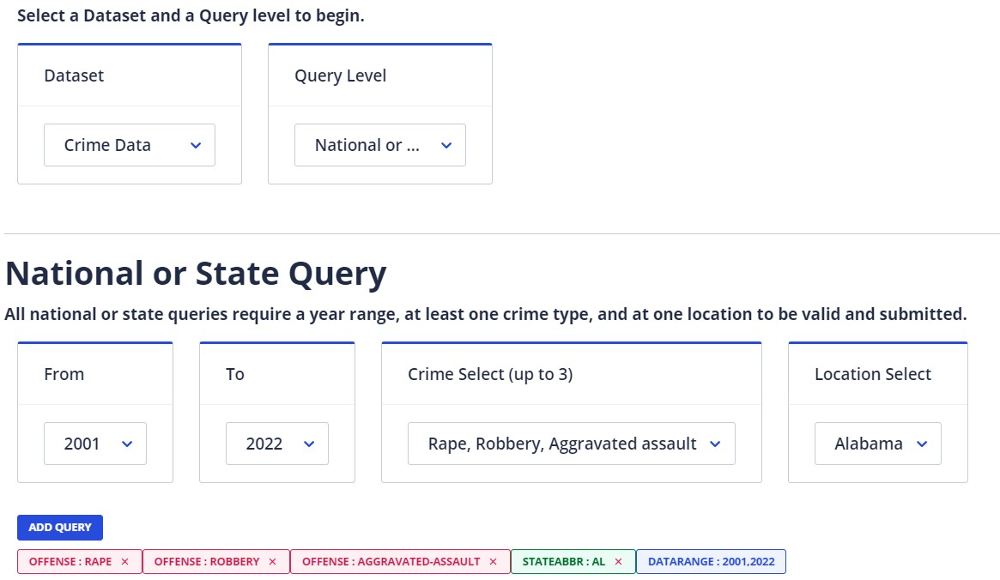

```{r setup, include=FALSE}
knitr::opts_chunk$set(echo = TRUE, warning = FALSE, message = FALSE)
```

## Load packages

Let's start by loading the packages we will use

```{r}
library(tidyverse)
library(readxl)
library(stringr)
library(ggplot2)
library(plm)          # for panel data
library(sandwich)     # for cluster robust standard errors
library(stargazer)    # for nice regression output
library(stringr)      # to extract strings
```

## Intro

Here we are looking at replicating aspects of this paper:

Siegel et al (2019) The Impact of State Firearm Laws on Homicide and Suicide Deaths in the USA, 1991–2016: a Panel Study, J Gen Intern Med 34(10):2021–8.

## Data

The core data are information about Gun Laws and fatality statistics

### Gun Law data

Siegel and co-authors collated this information and published them on <https://www.statefirearmlaws.org/>. The following uploads the database. Each row indicates a state-year and in columns indicates whether in a particular state-year a policy is in place. 

```{r}
# set data directory
datadir <- "C:/Users/msassrb2/Dropbox (The University of Manchester)/ECON20222/202324/DiDexample/data/"

law_data <- read_excel(paste0(datadir,"Firearmlaws DATABASE_0.xlsx"))
law_data_codebook <- read_excel(paste0(datadir,"Firearmlaws codebook_0.xlsx"))
names(law_data_codebook) = make.names(names(law_data_codebook))
```

The following lists all the different policy categories used.

```{r}
names(law_data)
```

You can get details on particular policies by looking at the codebook. For instance if you wish to know what policy is "junkgun".

```{r}
print(toString(law_data_codebook[law_data_codebook$Variable.Name == "junkgun","Detailed.Description.of.Provision"]))
```

The policies are also in a number of different categories and sub categories (not shown here)

```{r}
table(law_data_codebook$Category)
```

The most recent observation from the policy database is 2020.

### State level fatality data

These are from the [US Center for Disease Control](https://wisqars.cdc.gov/), in particular the "Fatal and Nonfatal Injury Reports".

Data are in state level files for Years, Values with `**` indicate values below 20. We remove this note.

```{r}

deaths_data_race <- read_csv(paste0(datadir,"AL by race.csv"), na = "--")
names(deaths_data_race) = make.names(names(deaths_data_race))
# only keep rows that start with the state name 
deaths_data_race <- deaths_data_race %>% filter(State == "Alabama")

# remove "**", needs applying twice
remove_astast <- function(x){ return (str_remove(x, "[**]"))}
test <- data.frame(lapply(deaths_data_race,remove_astast))
deaths_data_race <- data.frame(lapply(test,remove_astast))

# turn data into numeric
deaths_data_race$Deaths <- as.numeric(deaths_data_race$Deaths)
head(deaths_data_race,10)

```

Let's explore which types of causes of death they have and which race categories.

```{r}
print("Causes of death")
unique(deaths_data_race$Mechanism)

print("race categories")
unique(deaths_data_race$Race)
```
When checking the notes to the table you will realise that they do not report number of deaths if they are below 10. For values below 20 they are labeled as unsafe values which is where we remove the `**`. This means that we cannot accumulate numbers across races to get totals in the causes of deaths categories. 

Let's look at the data for Alabama not broken down by race:

```{r}

deaths_data <- read_csv(paste0(datadir,"AL.csv"), na = "--")
names(deaths_data) = make.names(names(deaths_data))
# only keep rows that start with the state name 
deaths_data <- deaths_data %>% filter(State == "Alabama")

# remove "**", needs applying twice
remove_astast <- function(x){ return (str_remove(x, "[**]"))}
test <- data.frame(lapply(deaths_data,remove_astast))
deaths_data <- data.frame(lapply(test,remove_astast))

# turn data into numeric
deaths_data$Deaths <- as.numeric(deaths_data$Deaths)
head(deaths_data,10)

```

From this example you can see that accumulating from the data by race would not have worked. While the 2021 data for death by "cut/pierce" do indeed add up to 48 when adding the data broken down by race, adding up the data for drowning from the race level data we get 75, whereas here we have 82.

We therefore continue to work with the data not filtered by race to use the total category data as in the last file. If you wanted to analyse the data by race you would have to download all the state-wide data filtered by race as in the earlier file (AL by race.csv).

When downloading the data from CDC website you can only download the data for one state at the time. Here are the filter settings used when downloading data from the WISQARS Fatal and Nonfatal Injury Reports.

image: 

After downloading these data you should have 51 such files, one for each state. This is the point where we have to do a bit of organising. Make sure that the files a clear naming structure. Here we saved the files under the two letter abbreviation, for instance "AL" for Alabama. At this stage you should make sure that you have a list of all the states and the associated abbreviations. You can get such a list from many places. Search the internet for something like "list of us states and abbreviations". 

I saved such a table into an Excel file

```{r}
USstates <- read_excel(paste0(datadir,"USStates_Dictionary.xlsx"))
head(USstates)
```

Working with 51 files is awkward and we should merge these data together into one dataframe. If we know that there will be 52 files all structured the same way (as they all come from the same source) and all named consistently, using the two letter abbreviation, then we should be able to "automate" the merging process.

```{r}
# start with first state
USstates_code <- USstates$State_code[1]
USstates_name <- USstates$State[1]
filename <- paste0(datadir, USstates_code, ".csv")

deaths_data <- read_csv(filename, na = "--")
# only keep rows that start with the state name 
deaths_data <- deaths_data %>% filter(State == "Alabama")

for (i in seq(2,nrow(USstates))){
  USstates_code <- USstates$State_code[i]
  USstates_name <- USstates$State[i]
  filename <- paste0(datadir, USstates_code, ".csv")
  
  # get the next file
  temp_data <- read_csv(filename, na = "--")
  # only keep rows that start with the state name 
  temp_data <- temp_data %>% filter(State == USstates_name)
  
  # attach to deaths_data
  deaths_data <- bind_rows(deaths_data,temp_data)

}


#after loop
names(deaths_data) = make.names(names(deaths_data))

# remove "**", needs applying twice
remove_astast <- function(x){ return (str_remove(x, "[**]"))}
test <- data.frame(lapply(deaths_data,remove_astast))
deaths_data <- data.frame(lapply(test,remove_astast))

# turn data into numeric
deaths_data$Year <- as.numeric(deaths_data$Year)
deaths_data$Deaths <- as.numeric(deaths_data$Deaths)
deaths_data$Age.Adjusted.Rate <- as.numeric(deaths_data$Age.Adjusted.Rate)
deaths_data$Population <- as.numeric(deaths_data$Population)
deaths_data$Crude.Rate <- as.numeric(deaths_data$Crude.Rate)
deaths_data$Years.of.Potential.Life.Lost <- as.numeric(deaths_data$Years.of.Potential.Life.Lost)

```


Let us now merge the death and policy data. First we compare the variable names to ensure that we have matching variables

```{r}
names(deaths_data)
names(law_data)
```

We want to match on State and Year, but note that the variables are capitalised in `deaths_data` and not capitalised in `law_data`. As R is case sensitive we will have to harmonise the names before merging

```{r}
names(law_data)[names(law_data) == "state"] <- "State"
names(law_data)[names(law_data) == "year"] <- "Year"
merge_data <- merge(deaths_data,law_data, all.x = TRUE)
```

We end up with 20895 rows of data, We have 51 states, 21 years and 21 methods of death. If we had a complete set of observations this would deliver 22,491 obs, but for some states we are "missing" some methods of death.

Let us check this to make sure

```{r}
table1 <- merge_data %>% group_by(State, Year) %>%
                          summarise(n = n()) %>%
                          spread(Year,n) %>% print()
```

As you can see from this table, the number of observations by State/Year is often less than 21.

Unfortunately the data series, when accessed through this database, only start in 2001. In the Siegel et al. (2019) paper data from 1991 are used (up to and including 2016). This means that here we can use data from 2001 to 2020 (last policy observation).

Before we continue there is one extra item to take care off. We already merged two datafiles and we will merge data from more datafiles a little later. When one merges on state names there is always the risk that different datasets use slightly different spelling and therefore the data may not match perfectly. This is one reason why there are codes for states and countries. In the US there are two letter codes representing states. They are contained in the `USstates` dataframe we previously loaded, but they are not yet contained in the `merge_data` dataframe. Let us add an additional column `State_code` with that two letter code.

```{r}
merge_data <- merge(merge_data, USstates)
names(merge_data)[names(merge_data)=="Code"] <- "State_code"
```

We will use this to facilitate the merging of datafiles.


## Summary Stats

Let's calculate some firearm death statistics. The data from the CDC deliver an age adjusted rate which indicates the number of deaths for every 100,000 of population in state $s$ in a particular year $t$.

```{r}
table2 <- merge_data %>% filter(Mechanism == "Firearm") %>% 
                          group_by(State) %>% 
                          summarise(avg_aarate = mean(Age.Adjusted.Rate,na.rm = TRUE), n=n()) %>% 
                          arrange(-avg_aarate) %>%  print()
```

Let's look at a few time-series plots

```{r}
plot1data <- merge_data %>% filter(Mechanism == "Firearm") %>% 
                            filter(State %in% c("Alabama","Tennessee","Maine", "New York"))
p1 <- ggplot(plot1data, aes( x = Year, y = Age.Adjusted.Rate, color = State)) +
            geom_line() +
            labs(title="Age Adjusted Death by Firearm Rates")
p1
```

There clearly seems to be an upward trend in the number of firearm deaths after 2015,but for New York in this selection of States.

## Initial Diff-in-Diff

### Policy set-up

We wish to evaluate whether a particular gun control policy has a causal effect. Let is start by looking at universal background checks. We can refer back to the `law_data_codebook` to see which policy codes are available. In fact there are two policy columns that relate to universal background checks.

```{r}
print(toString(law_data_codebook[law_data_codebook$Variable.Name == "universal","Detailed.Description.of.Provision"]))
print(toString(law_data_codebook[law_data_codebook$Variable.Name == "universalh","Detailed.Description.of.Provision"]))

```

So the difference is that the `universalh` policy only covers handguns whereas `universal` covers all firearms. We shall create a new variable that combines these two. We will create a new variable $pol_{st}$ that takes the value 1 if either of these two policies is in place in state $s$ at time $t$.

To make this happen with the tidyverse approach we have to indicate to R, before calling the definition of the new variable `mutate(pol_ubc = max(universal,universalh))` that the max here is an operation that should happen row-by-row (`rowwise()`).

```{r}
merge_data <- merge_data %>% rowwise() %>%  mutate(pol_ubc = max(universal,universalh)) # universal background checks
```

A different policy to consider, as it was found to have significant effects in the Siegel et al. (2019), is that of a ban for weapons for people who had violent misdemeanors on their records.


```{r}
print(toString(law_data_codebook[law_data_codebook$Variable.Name == "violent","Detailed.Description.of.Provision"]))
print(toString(law_data_codebook[law_data_codebook$Variable.Name == "violenth","Detailed.Description.of.Provision"]))
print(toString(law_data_codebook[law_data_codebook$Variable.Name == "violentpartial","Detailed.Description.of.Provision"]))
```

As for universal background checks we set up a policy variable `pol_vmisd`.

```{r}
merge_data <- merge_data %>% rowwise() %>%  mutate(pol_vmisd = max(violent,violenth,violentpartial)) # universal background checks
```


In the Siegel et al. (2019) paper there was one policy which was estimated to have a positive effect on firearm deaths. This policy was labelled "Shall issue laws" and described as the "absence of any discretion of law enforcement authorities in deciding whether to grant a concealed carry permit". When scanning the `law_data_codebook` it is not obvious which entry represents this. 

You search the dataframe with the following function which finds the entries in `law_data_codebook$Detailed.Description.of.Provision` which contains the word "shall"

```{r}
grepl("shall",law_data_codebook$Detailed.Description.of.Provision)
```

If R finds a cell which contains that word it will represent this with a "TRUE" in the results. There is none, so the word "shall" is not contained in any of the descriptions.

Re-read the above description and you will realise that it actually describes the **absence** of a policy to control who should be allowed to carry a concealed weapon. With that in mind scan the policies categorised as "Concealed carry permitting" policies. You will find a policy labelled "mayissue" (in line 77). The describtion is:

```{r}
print(toString(law_data_codebook[law_data_codebook$Variable.Name == "mayissue","Detailed.Description.of.Provision"]))
```
Therefore it may well be that the policy in the Siegel et al. (2019) paper is coded as the absence of that policy (we cannot really be certain about this as the authors do not exactly describe this, although we could investigate further as in their Table 1 they also provide listings of states and number of policy changes). We could therefore code it as `1-mayissue`. However, for now we just use "mayissue" as a policy which has a potential firearm death reducing effect (rather than an increasing effect of the absence of the policy).

```{r}
merge_data <- merge_data %>% rowwise() %>%  mutate(pol_mayissue = mayissue) # universal background checks
```

There is a range of other policies that were all estimated to not have a policy impact. Of course the conclusion may change as we are looking at a different sample period. 


Before we go to estimating models it is useful to figure out how much variation we can observe in the policy in the states. What we require for a difference-in-difference setup is variation in policy in at least one state. A good way to do that is to visualise the series of 0s and 1s for a particular policy across the states. This is not a standard visualisation task, so it is likely that you may wish to search the internet for advise on "R ggplot visualise elements of a matrix". This admittedly already uses the a pre-conception that representing the 0s and 1s in a matrix is udeful.

```{r}
ggplot(merge_data, aes(x = Year, y = State)) + 
  geom_raster(aes(fill=pol_ubc)) + 
  scale_fill_gradient(low="grey90", high="red") +
  labs(x="Year", y="State", title="Policy - Universal Background Check") 
```
There are two important things you can see from here.

1. There are no data for 2021 (as discussed above) and no data for the District of Columbia, reducing the number of effetive states to 50.
1. Most states do not have any universal background checks policy. Some states have this policy in place for the entire sample period (e.g. Indiana).
1. Some states have a universal background check policy in place for the entire sample period, e.g. Rhode Island.
1. Some states introduce the policy during the sample period, e.g. Virginia. This is important as a DiD estimation relies on these states for identifying the policy effect.

Let's create the similar plot for the other two policies.

```{r}
ggplot(merge_data, aes(x = Year, y = State)) + 
  geom_raster(aes(fill=pol_vmisd)) + 
  scale_fill_gradient(low="grey90", high="red") +
  labs(x="Year", y="State", title="Policy - Violent Misdemeanors") 
```

Here you can see that there is variation across states, but no variation in a state. This means that, with the given sample, we cannot investigate the effectiveness of the violent misdemeanor policy. In the Siegel et al. (2019) paper they can investigate the policy as there is some variation between 1991 and 2000. Running the following code would demonstrate this (Result not shown here). 

```{r, eval = FALSE}
temp <- law_data
temp <- temp %>% rowwise() %>%  mutate(pol_vmisd = max(violent,violenth,violentpartial)) # universal background checks

ggplot(temp, aes(x = Year, y = State)) + 
  geom_raster(aes(fill=pol_vmisd)) + 
  scale_fill_gradient(low="grey90", high="red") +
  labs(x="Year", y="State", title="Policy -Violent Misdeameanor - 1991-2020") 
```


```{r}
ggplot(merge_data, aes(x = Year, y = State)) + 
  geom_raster(aes(fill=pol_mayissue)) + 
  scale_fill_gradient(low="grey90", high="red") +
  labs(x="Year", y="State", title="Policy - May Issue") 
```
We can see that there is variation in the policy inside states and therefore we can investigate the policy. The variation is of the type that this policy existed at the beginning of the sample, but then was withdrawn, e.g. Wisconsin or Alabama. In fact this may be the reason why Siegel et al. (2019) used the reverse of this as a policy.

### Estimation

We will now estimate a TWFE model where $log(rate_{st})$ is the log of the age adjusted death rate by Firearm. At this stage there are no covariates.

$$log(rate_{st}) = \alpha_s + \gamma_t + \tau~ pol_{st} + error_{st}$$

We extract the data we need and set them up as a panel data set

```{r}
merge_data <- merge_data %>% filter(Mechanism == "Firearm") %>% 
                    select(State, State_code, Year, Population, Mechanism, pol_ubc, pol_vmisd, pol_mayissue ,Age.Adjusted.Rate) %>% 
                    mutate(logy = log(Age.Adjusted.Rate))
pdata <- pdata.frame(merge_data, index = c("State","Year")) # defines the panel dimensions
```

Now we estimate the model for the `pol_ubc` and `pol_mayissue`.

```{r}
mod_twfe1 <- lm(logy~State+Year+pol_ubc, data = pdata)
se_twfe1 <- sqrt(diag(vcovCL(mod_twfe1, cluster = ~ State)))

mod_twfe2 <- lm(logy~State+Year+pol_mayissue, data = pdata)
se_twfe2 <- sqrt(diag(vcovCL(mod_twfe2, cluster = ~ State)))

stargazer(mod_twfe1, mod_twfe2, keep = c("pol_ubc","pol_mayissue"), type="text", se=list(se_twfe1,se_twfe2), 
          digits = 6, notes="Cluster (State) Robust standard errors in parenthesis")
```

The result for `pol_mayissue` is very close to that in Siegel et al. (2019) just with the opposite sign. The coefficient for the universal background policy has halfed (from -0.173 in the paper) to -0.086 here. This coefficient is now also statistically insignificant. 

### Investigating the difference

Let us investigate why our results are different. The first possibility is that we are not yet using all the covariates that were included in the Siegel et al. (2019) paper. Once they are included, coefficients may well change as.

One possible reason for this is that a lot of the policy variation  in that policy may have happened before 2001 and hence we do not see that in our sample. Let us visualise the policy variation as we can see it in the `law_data` dataframe which does show data all the way back to 1991.

```{r, eval = FALSE}
temp <- law_data
temp <- temp %>% rowwise() %>%  mutate(pol_ubc = max(universal,universalh)) # universal background checks

ggplot(temp, aes(x = Year, y = State)) + 
  geom_raster(aes(fill=pol_ubc)) + 
  scale_fill_gradient(low="grey90", high="red") +
  labs(x="Year", y="State", title="Policy - Universal Background Checks - 1991-2020") 
```

We can see that three states introduced universal background check policies before 2000, Cennecticut (CT), Massachusetts (MA) and Pennsylvania (PA).

A different reason why the results may be different is that we cannot be certain about the policy coding used by Siegel et al. (2019). We combined the two policies that had explicitly "universal" in their naming, however, there are more background check policies. In Table 1 of their paper they state which states had the policy implemented in 1991. They are CA, IL, MA, NJ and RI. However, in the above image we see that only CA and RI have the policy implemented in our coding. 

So we want to see whether we can figure out how Siegel et al. (2019) coded their policies. For that purpose we will extract the policy data for all policies in `Category == "Background checks"` for the five states listen Siegel.

```{r}
# extract all policy names which fall into the "Background checks" category
sel_policies <- law_data_codebook$Variable.Name[law_data_codebook$Category == "Background checks"]

test <- law_data %>% filter(State %in% c("California", "Illinois", "Massachusetts", "New Jersey", "Rhode Island")) %>% 
                      filter(Year == 1991) %>% 
                      select(State, sel_policies)
print(t(test))  # t() is to transpose the table for esier inspection
```
You can see from here that "universalpermit" and "universalpermit" were in place for IL, MA and NJ in 1991. When you check the policy details you will see that these policies also contain a universal background check (via a permit). We therefore try to redefine the `pol_ubc` variable to include these two policies.

```{r, eval = FALSE}
temp <- law_data
temp <- temp %>% rowwise() %>%  mutate(pol_ubc = max(universal,universalh,universalpermit,universalpermith)) # universal background checks

ggplot(temp, aes(x = Year, y = State)) + 
  geom_raster(aes(fill=pol_ubc)) + 
  scale_fill_gradient(low="grey90", high="red") +
  labs(x="Year", y="State", title="Policy - Universal Background Checks - 1991-2020") 
```
Now you can see that there are substantially more than 5 states with the policy in place in 1991. Therefore we know that this is not the correct definition either. Let's see whether taking out the policies that apply to handguns only rectifies the issue.


```{r, eval = FALSE}
temp <- law_data
temp <- temp %>% rowwise() %>%  mutate(pol_ubc = max(universal,universalpermit)) # universal background checks

ggplot(temp, aes(x = Year, y = State)) + 
  geom_raster(aes(fill=pol_ubc)) + 
  scale_fill_gradient(low="grey90", high="red") +
  labs(x="Year", y="State", title="Policy - Universal Background Checks - 1991-2020") 
```

This is also not quite right as we now also have Hawaii as one of the states.

We conclude that it is not very clear from the paper itself how exactly this variable is defined. This is a demonstration of how important it is to clearly document how you code data. Doing this in the paper directly is often cumbersome and may distract from the main message. This is why such information is often relegated to some online appendix or some published code. However, on this occasion, I could not find this information. 


## Data on covariates

The Siegel et al. (2019) paper uses a number of extra covariates that can be used in the DiD regressions.

* State unemployment data
* Number of law enforcement officers by state
* Violent crime rate (excl homicides)
* per capita alcohol consumption

We will obtain the data where we can and then create datafiles with State-Year observations such that we can merge them into the `merge_data` dataframe. For this to work smoothly, each of these datafiles should have a column called `State` with the name of the state and a column called `Year` with the year. The Spelling has to match this spelling.


### Unemployment data

Unemployment data are standard economic data and we can obtain them from [FRED](https://fred.stlouisfed.org/graph/?m=QzBC#).

```{r}
# note the skip = 1 to skip the first row, column headings are in row 2
# recall, always have a look at the original datafile
ur_data <- read.csv(paste0(datadir,"Unemployment Rate by State (Percent).csv"),skip = 1)
head(ur_data[,1:7])
```

The data are actually monthly data. And they are not in the long format (i.e. one row for a state-month observation). So there are two things we need to do with this file. 1) we need to turn it into a long format and then we need to average the unemployment rate over years. Let's start with turning this into a long format.

We start by removing the `Series.ID` variable and the `Region.Code` and renaming the `Region.Name` variable to `State`.

```{r}
ur_data <- ur_data %>% select(-Series.ID) %>% select(-Region.Code)
names(ur_data)[names(ur_data)=="Region.Name"] <- "State"
```

```{r}
ur_data_long <- ur_data %>% pivot_longer(!State, names_to = "Date", values_to = "ur")
head(ur_data_long)
```

Step 1 is done. You can now see that in the `date` column we have the monthly dates. They all have an "X" at the beginning which results from the fact that variable names in R have to start with a letter and when the data were imported R added an "X" to the column headings which were the dates. All we need from the dates is the year which in the last four digits. So what we want to extract from the `date` column is the last four digits. This is not an operation you come across very often and hence a web-search sounds like the way to go here. Go to your favourite search engine and search for something like "R extracting last characters".

You may find different pieces of advice as there are many different ways to achieve this. Here I adopt a method which uses the `str_sub` function (Check out the help function by typing `?str_sub` into the console.)

```{r}
ur_data_long$Year <- as.numeric(str_sub(ur_data_long$Date,-4))
head(ur_data_long)
```

As you can see, this has now created a `Year` column. All we got to do now is to calculate an average unemployment rate for each state in each year.

```{r}
ur_data_long <- ur_data_long %>% group_by(State, Year) %>% 
                                    summarise(ur = mean(ur))
```

Let's plot some data to confirm that we have obtained sensible data.

```{r}
plot1ur <- ur_data_long %>% 
                            filter(State %in% c("Alabama","Tennessee","Maine", "New York"))
p2 <- ggplot(plot1ur, aes( x = Year, y = ur, color = State)) +
            geom_line() +
            labs(title="Unemployment rate")
p2

```

This plot looks reasonable showing unemployment rate peaks in the aftermath of the financial crisis and Covid. `ur_data_long` is now ready to be merged with `merge_data`.

```{r}
merge_data <- merge(merge_data,ur_data_long, all.x = TRUE)
```

### Law enforcement officer numbers

The F.B.I. has a Crime Data Explorer and in there you can find a number of crime related data, amongst others the [Law Enforcement Employees Data](https://cde.ucr.cjis.gov/LATEST/webapp/#) which provides a detailed breakdown of law enforcement employees for very small geographies like cities. As the datafile contains state information we can aggregate these to state level data.


The data are saved in "law enforcement employees FBIdata_1960_2022.csv".

```{r}
officers_data <- read.csv(paste0(datadir,"law enforcement employees FBIdata_1960_2022.csv"))
```

Have a look at the spreadsheet to get an idea of the data. There are more than 700,000 rows of data. One row represents the information for one agency in a particular year. But when inspecting the datafile you would have seen that there are loots of agencies.

```{r}
officers_data[99,]
```

Let's start by changing the names of the State and Year variables.

```{r}
names(officers_data)[names(officers_data)=="data_year"] <- "Year"
names(officers_data)[names(officers_data)=="state_abbr"] <- "State_code"
```

As we need the number of officers in a state in one year we need to aggregate over all agencies in a particular year in a state. We also restrict our attention to years 2001 onwards.

```{r}
officers_data_agg <- officers_data %>% filter(Year >= 2001) %>% 
                                      group_by(State_code, Year) %>% 
                                      summarise(law.officers = sum(total_pe_ct))
```

Let's look at the data to get a feel for the information in these data.

```{r}
plot1off <- officers_data_agg %>% 
                            filter(State_code %in% c("AL","TN","ME", "WV"))
p2 <- ggplot(plot1off, aes( x = Year, y = law.officers, color = State_code)) +
            geom_line() +
            labs(title="Number of Law Enforcement Officers")
p2

```

You can see that the data in `officer_data_agg` are absolute numbers and we will have to scale them to number of officers per 100,000 population. We will do this after merging the data into `merge_data`.

```{r}
merge_data <- merge(merge_data,officers_data_agg, all.x = TRUE)
```

As it turns out that there are no officers data for West Virginia for the years 2008 and 2014, it was important to add the option ` all.x = TRUE` to ensure that these two years remain preserved for 2008 and 2014 in the merged dataset. Without this option, these two observations would be removed from the `merge_data` dataframe.

Before continuing we shall scale this variable by the population to calculate how many law enforcement officers a state has per 100,000 population.

```{r}
merge_data$law.officers.pc <- 100000*merge_data$law.officers/merge_data$Population
```

### Violent crime rate

From the F.B.I. website you can access the [Data Discovery Tool](https://cde.ucr.cjis.gov/LATEST/webapp/#/pages/home) which is an interface which gives you access for a range of data. There are four categories of violent crime, homicide, rape, robbery and aggravated assault. Tick the last three and then download the data state by state for the years 2001 to 2021.

image: 

While doing this for every state is a chore (although you can do it for 5 states at a time) it is ok as the resulting tables are all formatted identically and therefore it is fairly straightforward to get all data into one table.

In fact, when you download data like this, it may be wise to download more data than you now think you need. For instance you could download data back to 1991 (the Siegel sample) just in case you were to find the additional earlier years of firearm deaths. The data are available from "Violent crime excl homicide by State.xlsx".

```{r}
vcrime_data <- read_excel(paste0(datadir,"Violent crime excl homicide by State.xlsx"))
head(vcrime_data)
```

You can see that the data are not arranged in the format which we need, i.e. one row for each State-Year. Rather we have years in rows and states in columns. We start by renaming the first column 

```{r}
vcrime_data_long <- vcrime_data %>% pivot_longer(!Year, names_to = "State_code", values_to = "vcrime")
head(vcrime_data_long)
```

These are now in the right format for merging. Again we have number of crimes and we will want to transform it to a per 100,000 population measure once we merged this number into `merge_data`.

```{r}
merge_data <- merge(merge_data,vcrime_data_long, all.x = TRUE)
```

Before continuing we shall scale this variable by the population to calculate how many law enforcement officers a state has per 100,000 population.

```{r}
merge_data$vcrime.pc <- 100000*merge_data$vcrime/merge_data$Population
```


### Per-capita alcohol consumption

The Siegel paper indicates that two different sources were used to obtain a full set of data. One of the sources was the National Institute on Alcohol Abuse and Alcoholism. I therefore performed a web search for "national institute on alcohol abuse and alcoholism state data" and was directed to [Surveillance Report webpage](https://www.niaaa.nih.gov/publications/surveillance-reports) which seemed to contain under Surveillance Report #120 exactly what was needed. Under that item there was a link to a [datafile](https://www.niaaa.nih.gov/sites/default/files/pcyr1970-2021.txt) which seemed to contain exactly the information needed.

This is a text file (it is best opened with a basic text editor, in Windows there is one called Notepad, on a Mac there is one called TextEdit). At the beginning of the vile you will see information on the variables contained in the file. Here we have converted this text file into a csv file (which you can achieve by copyng and pasting the portions of the file that actually contain the data into Excel and then applying the "Text to columns" function).


```{r}
alcc_data <- read.csv(paste0(datadir,"Alcohol consumption by US state.csv"))
head(alcc_data)
```

You can see that here, the states are not indexed by their name, nor by their two letter code, but rather by a number. So to be able to merge this with the remaining data we need to introduce either the name or the two letter code. At the top of the text file linked above you can see which number relates to which state. We copied that information into a second US states dictionary file. 

```{r}
USstates_v2 <- read_excel(paste0(datadir,"USStates_Dictionary_v2.xlsx"))
head(USstates_v2)
```

We now merge this numeric code into the USstates dataframe.

```{r}
USstates <- merge(USstates, USstates_v2)
head(USstates)
```

Now we can use the numeric code to merge the `State_code` to the `alcc_data` dataframe; after equalising the names of the numeric code column such that we can match on these.

```{r}
names(alcc_data)[names(alcc_data)=="State.no"] <- "State_num_code"
alcc_data <- merge(alcc_data,USstates)
```

Finally we should identify the variable which we want to merge into `merge_data`. The Siegel et al. (2019) paper does not clearly state which series was to use, but for now we use the variable called `Gallons.of.ethanol.per.capita.age.14.and.older` and will then rename this variable to `alcc_pc`. Finally, upon inspecting the dataframe you will see that for each State-Year there are 4 lines with observations for beverage types 1, 2, 3 and 4. The data description in the earlier text file comes to help to identify  1:Spirits, 2: Wine, 3: Beer and 4: All beverages. We chose `Type.of.beverage == "4"`.

```{r}
names(alcc_data)[names(alcc_data)=="Gallons.of.ethanol.per.capita.age.14.and.older"] <- "alcc.pc"
alcc_data <- alcc_data %>% filter(Type.of.beverage == "4") %>% 
                  filter(Year >= 2001) %>% 
                  select(State_code, Year, alcc.pc) %>% 
                  mutate(alcc.pc = alcc.pc/10000) %>% 
                  arrange(State_code, Year)
```

Note that we divided the alcc.pc variable by 10,00. As described in the text file, this scales the variable to gallons per person. This file is ready for merging to `merge_data`.

```{r}
merge_data <- merge(merge_data,alcc_data, all.x = TRUE)
```

### Incarceration rate

The paper says that the data come from the U.S. Bureau of Justice Statistics website. If we search for that we get to [this website](https://bjs.ojp.gov/). Using the search function from that website you do fairly quickly find your way to annual reports like [this one for 2021](https://bjs.ojp.gov/library/publications/prisoners-2021-statistical-tables) from where you can download the data tables of the report, one of which is the table which lists the number of prisoners by state. However, having to find this table for all years is a rather burdensome endeavour. Furthermore, there is no guarantee that the tables, across the years, have stayed in the same format and therefore collating a complete dataset in this way is unlikely to be straightforward.

On that page is a "Related Datsets" section and there is a link labeled "National Archive of Criminal Justice Data's (NACJD) 1978-2021". If you follow that link you get to [this website](https://www.icpsr.umich.edu/web/NACJD/studies/38555) from where you can download a complete dataset. I downloaded the ASCII version and converted that to a "csv" file which we can upload here as "Incarceration data.csv". The file has data organised in State/Years by row. There are a lot (231) variables and as you download the data you should also download the codebook which explains what the variables are. From that document you can see that you can get information on incarceration numbers by gender and length of maximum sentence. There is a variable that gives the total number of person's incarcerated in a state at 31 December of any given year. This variable is labelled `CUSTTOT`. While the Siegel et al. (2019) paper is unclear on what number they use this seems the most likely and we will use it here.

```{r}
# we also specify codes for missing data
incarceration_data <- read.csv(paste0(datadir,"Incarceration data.csv"),na.strings = c("-9" , "-8" , "-2" , "-1"))

```


Let's look at a few plots to become familiar with the data

```{r}
plot1inc <- incarceration_data %>% 
                            filter(STATE %in% c("AL","TN","ME", "NY"))
p2 <- ggplot(plot1inc, aes( x = YEAR, y = CUSTOTT, color = STATE)) +
            geom_line() +
            labs(title="Incarceration Numbers")
p2
```

As you can see from the plot, there are only data up to 1982. To investigate what is going on we shall look at data for one state, say Alabama (AL).

```{r}
test <- incarceration_data %>% filter(STATE == "AL")
```

If you look at the resulting table you will realise that apparently the variables that were collected changed between 1982 and 1983. In particular, the breakdown by gender is only available from 1983 onwards. The variables that may be of interest to us (after 1983) are `CUSTOTM` and `CUSTOTF` which capture the male and female totals in custody. The sum of the two should then represent the total number of people in custody. We therefore may now want to calculate `CUSTOTT` as the sum of these two for 1983 onwards.

```{r}
incarceration_data <- incarceration_data %>% mutate(CUSTOTT = case_when(
                                                  !is.na(CUSTOTT) ~ CUSTOTT,
                                                  is.na(CUSTOTT) ~ CUSTOTF+CUSTOTM)) 
```

You should look at the dataset to confirm that we now have data in the `CUSTOTT` column for all years. We can also confirm this graphically.

```{r}
plot1inc <- incarceration_data %>% 
                            filter(STATE %in% c("AL","TN","ME", "NY"))
p2 <- ggplot(plot1inc, aes( x = YEAR, y = CUSTOTT, color = STATE)) +
            geom_line() +
            labs(title="Incarceration Numbers")
p2
```

This looks good and in particular we cannot see any obvious structural break between 1982 and 1983, giving us confidence that our calculation is sensible.

Now we extract the data we will need for our analysis and which we will merge into our `merge_data` dataframe.

```{r}
incarceration_data <- incarceration_data %>% filter(YEAR >= 2001) %>% 
                          select(YEAR, STATE, CUSTOTT)
```

Finally we will have to adjust the column names for the state code and the year to match those in `merge_data` to facilitate the merging process. We also change the name of the `CUSTOTT` variable.

```{r}
names(incarceration_data)[names(incarceration_data)=="YEAR"] <- "Year"
names(incarceration_data)[names(incarceration_data)=="STATE"] <- "State_code"
names(incarceration_data)[names(incarceration_data)=="CUSTOTT"] <- "incarc"
```

As you can see these are the total number of person incarcerated. We will want to scale this to a number like person per 100,000 population. We can do that after merging as `merge_data` contains a variable which contains the size of the population in a state in a particular year.

```{r}
merge_data <- merge(merge_data,incarceration_data, all.x = TRUE)
```

We now scale the variable to represent the number of people incarcerated for every 100,000.

```{r}
merge_data$incarc.pc <- 100000*merge_data$incarc/merge_data$Population
```
