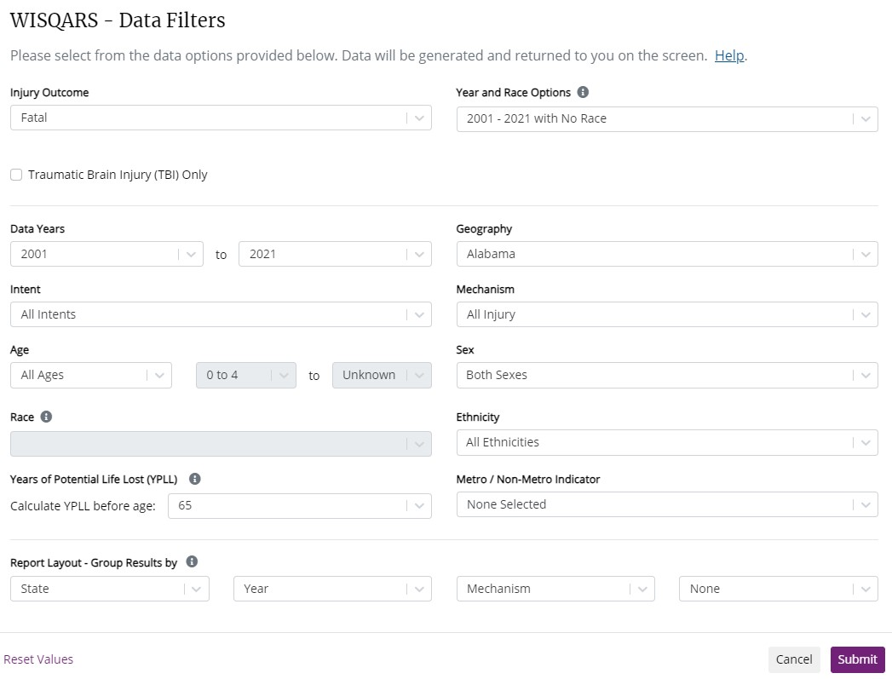

```{r setup, include=FALSE}
knitr::opts_chunk$set(echo = TRUE, warning = FALSE, message = FALSE)
```

## Load packages

Let's start by loading the packages we will use

```{r}
library(tidyverse)
library(readxl)
library(stringr)
```

## Intro

Here we are looking at replicating aspects of this paper:

Siegel et al (2019) The Impact of State Firearm Laws on Homicide and Suicide Deaths in the USA, 1991–2016: a Panel Study, J Gen Intern Med 34(10):2021–8.

## Data

The core data are information about Gun Laws and fatality statistics

### Gun Law data

Siegel and co-authors collated this information and published them on <https://www.statefirearmlaws.org/>. The following uploads the database. Each row indicates a state-year and in columns indicates whether in a particular state-year a policy is in place. 

```{r}
law_data <- read_excel("C:/Users/msassrb2/Dropbox (The University of Manchester)/ECON20222/202324/DiDexample/data/Firearmlaws DATABASE_0.xlsx")
law_data_codebook <- read_excel("C:/Users/msassrb2/Dropbox (The University of Manchester)/ECON20222/202324/DiDexample/data/Firearmlaws codebook_0.xlsx")
names(law_data_codebook) = make.names(names(law_data_codebook))
```

The following lists all the different policy categories used.

```{r}
names(law_data)
```

You can get details on particular policies by looking at the codebook. For instance if you wish to know what policy is "junkgun".

```{r}
print(toString(law_data_codebook[law_data_codebook$Variable.Name == "junkgun","Detailed.Description.of.Provision"]))
```

The policies are also in a number of different categories and sub categories (not shown here)

```{r}
table(law_data_codebook$Category)
```


### State level fatality data

These are from the [US Center for Disease Control](https://wisqars.cdc.gov/), in particular the "Fatal and Nonfatal Injury Reports".

Data are in state level files for Years, Values with `**` indicate values below 20. We remove this note.

```{r}

deaths_data_race <- read_csv("C:/Users/msassrb2/Dropbox (The University of Manchester)/ECON20222/202324/DiDexample/data/AL by race.csv", na = "--")
names(deaths_data_race) = make.names(names(deaths_data_race))
# only keep rows that start with the state name 
deaths_data_race <- deaths_data_race %>% filter(State == "Alabama")

# remove "**", needs applying twice
remove_astast <- function(x){ return (str_remove(x, "[**]"))}
test <- data.frame(lapply(deaths_data_race,remove_astast))
deaths_data_race <- data.frame(lapply(test,remove_astast))

# turn data into numeric
deaths_data_race$Deaths <- as.numeric(deaths_data_race$Deaths)
head(deaths_data_race,10)

```

Let's explore which types of causes of death they have and which race categories.

```{r}
print("Causes of death")
unique(deaths_data_race$Mechanism)

print("race categories")
unique(deaths_data_race$Race)
```
When checking the notes to the table you will realise that they do not report number of deaths if they are below 10. For values below 20 they are labeled as unsafe values which is where we remove the `**`. This means that we cannot accumulate numbers across races to get totals in the causes of deaths categories. 

Let's look at the data for Alabama not broken down by race:

```{r}

deaths_data_race <- read_csv("C:/Users/msassrb2/Dropbox (The University of Manchester)/ECON20222/202324/DiDexample/data/AL.csv", na = "--")
names(deaths_data_race) = make.names(names(deaths_data_race))
# only keep rows that start with the state name 
deaths_data_race <- deaths_data_race %>% filter(State == "Alabama")

# remove "**", needs applying twice
remove_astast <- function(x){ return (str_remove(x, "[**]"))}
test <- data.frame(lapply(deaths_data_race,remove_astast))
deaths_data_race <- data.frame(lapply(test,remove_astast))

# turn data into numeric
deaths_data_race$Deaths <- as.numeric(deaths_data_race$Deaths)
head(deaths_data_race,10)

```

From this example you can see that accumulating from the data by race would not have worked. While the 2021 data for death by "cut/pierce" do indeed add up to 48 when adding the data broken down by race, adding up the data for drowning from the race level data we get 75, whereas here we have 82.

We therefore continue to work with the data not filtered by race to use the total category data as in the last file. If you wanted to analyse the data by race you would have to download all the state-wide data filtered by race as in the earlier file (AL by race.csv).

When downloading the data from CDC website you can only download the data for one state at the time. Here are the filter settings used when downloading data from the WISQARS Fatal and Nonfatal Injury Reports.

image: 


