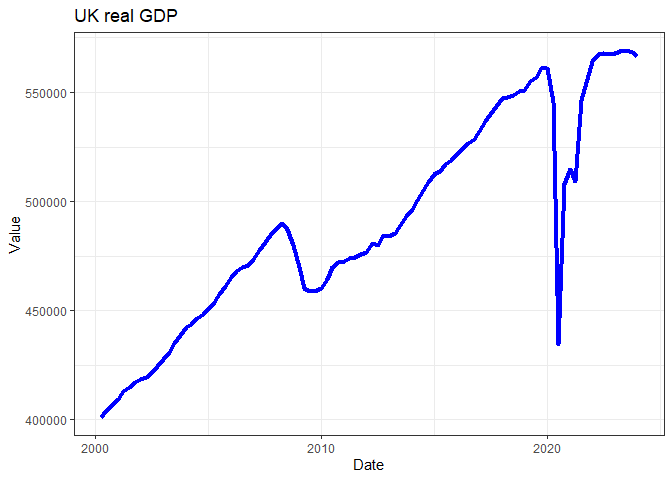
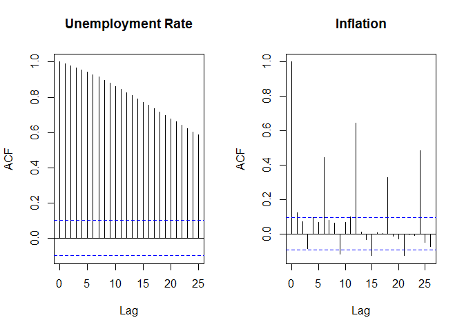
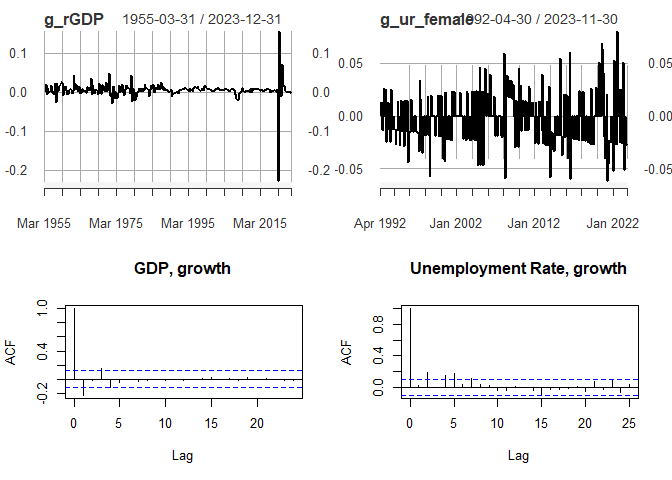
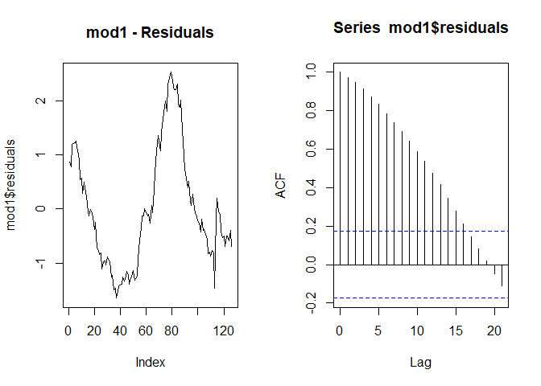
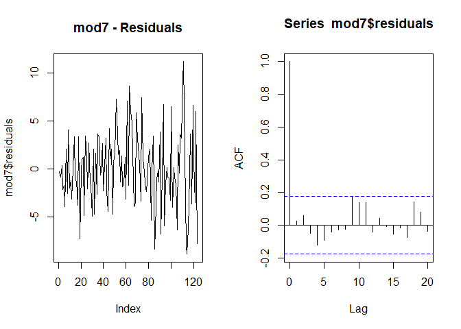

```r
library(tidyverse)
library(ggplot2)
library(pdfetch)
library(xts)
library(AER)          # access to HS robust standard errors
library(stargazer)
source("stargazer_HC.r")  # includes the robust regression display
source("stargazer_HAC.r")  # includes the Newey-West standard errors
library(gridExtra)  # required for the combination of ggplots
```

# Import data and look at ACF

When you get data from the ONS you need to know what the series id is and in which ONS dataset you can find these data. The way to find out what that info is it is best to go to (the ONS time series tool)[https://www.ons.gov.uk/timeseriestool].

For instance we can get real GDP data (id: AMBI) from the UKEA databank.


```r
rGDP <- pdfetch_ONS("ABMI","UKEA")  
periodicity(rGDP)   # check data availability
```

```
## Quarterly periodicity from 1955-03-31 to 2022-12-31
```

```r
names(rGDP) <- "real GDP" # give a sensible name

# keep all the data including 2020-Q3
# this was the last observation available at the time this was written
# remove this line if you want to use updated data
rGDP <- rGDP["/2022-12"]  

# we prepare the data for being kept in long format
# that is useful for plotting in ggplot
rGDP_l <- data.frame(index(rGDP),stack(as.data.frame(coredata(rGDP))))
# Give sensible names to columns
names(rGDP_l)[1] <- "Date"   # first col will have date
names(rGDP_l)[2] <- "Value"  # second col will have value
names(rGDP_l)[3] <- "id"     # third col will have series name
```

Let's look at the series


```r
ggplot(rGDP_l,aes(x =Date, y=Value)) + 
  geom_line(colour = "blue",size = 1.5) +
  ggtitle("UK real GDP") +
  theme_bw()
```

<!-- -->

If you want to plot a subsample of the data only, the easiest way to do that is to use the `subset` function as you call the data into the `ggplot` function. Compare what has changed in the code and figure out what the `subset` function did.


```r
ggplot(subset(rGDP_l, Date >"2000-01-01"),aes(x =Date, y=Value)) + 
  geom_line(colour = "blue",size = 1.5) +
  ggtitle("UK real GDP") +
  theme_bw()
```

<!-- -->

Can you change the above code such that only the GDP from 2005 onwards is shown? 

Let's calculate the autocorrelation function:


```r
temp_acf <- acf(rGDP)
```

<!-- -->

Now we download female unemployment rates and monthly inflation rates from the ONS database. On both occasions we put the 


```r
# Download: Female unemployment rate (YCPL in database LMS)
ur_female <- pdfetch_ONS("YCPL","LMS")
names(ur_female) <- "Unemp Rate (female)"
periodicity(ur_female)
```

```
## Monthly periodicity from 1992-04-30 to 2023-01-31
```

```r
# keep all the data including 2022-Jan
# this was the last observation available at the time this was written
# remove this line if you want to use updated data
ur_female <- ur_female["/2022-12"]  

ur_female_l <- data.frame(index(ur_female),stack(as.data.frame(coredata(ur_female))))
names(ur_female_l)[1] <- "Date"
names(ur_female_l)[2] <- "Value"
names(ur_female_l)[3] <- "id"

# Download: Inflation rate (D7OE in database MM23)
infl <- pdfetch_ONS("D7OE","MM23")
names(infl) <- "CPI Inflation"
periodicity(infl)
```

```
## Monthly periodicity from 1988-02-29 to 2023-02-28
```

```r
# keep all the data including 2022-jan
# this was the last observation available at the time this was written
# remove this line if you want to use updated data
infl <- infl["/2022-12"]  

infl_l <- data.frame(index(infl),stack(as.data.frame(coredata(infl))))
names(infl_l)[1] <- "Date"
names(infl_l)[2] <- "Value"
names(infl_l)[3] <- "id"
```

Now we put both series into one dataframe by attaching the individual dataframes. We can do this as we gave identical names to the three columns in both dataframes. 


```r
data_l <- rbind(rGDP_l,ur_female_l)
data_l <- rbind(data_l,infl_l)
```


Now we produce some time series plots and ACF functions


```r
p1 <- ggplot(data_l[data_l$id == "Unemp Rate (female)",],aes(x =Date, y=Value)) + 
  geom_line(colour = "blue",size = 1.0) +
  ggtitle("Female Unemployment rate") +
  theme_bw()

p2 <- ggplot(data_l[data_l$id == "CPI Inflation",],aes(x =Date, y=Value)) + 
  geom_line(colour = "blue",size = 1.0) +
  ggtitle("Inflation Rate") +
  theme_bw()

grid.arrange(p1, p2, nrow=1, ncol=2)
```

<!-- -->
The `grid.arrange(p1, p2, nrow=1, ncol=2)` line in the code helped us to set the two images next to each other. That is very nice and often useful when you present data. This sort of effect can be achieved in different ways. It is important to realise that usually you can do the same think in R in different ways. So let us present such a different way. Below it is the `par(mfrow=c(1,2))` line which tells R that the next plots should be presented in a 1 by 2 frame.


```r
par(mfrow=c(1,2))

acf(ur_female,main = "Unemployment Rate")
acf(infl, main = "Inflation")
```

<!-- -->

It will be interesting to see what happens when we difference data series (or often their logs).


```r
g_rGDP <-diff(log(rGDP))
names(g_rGDP) <- "GDP, quarterly growth rate"
g_ur_female <-diff(log(ur_female))
names(g_ur_female) <- "Growth in Unemp Rate (female)"
```


```r
par(mfrow=c(1,2))

acf(g_rGDP,main = "GDP, growth")
acf(g_ur_female, main = "Unemployment Rate, growth")
```

When you do this you will get an error message as the differencing created a missing value in the `g_rGDP` and `g_ur_female` series and the `acf` function really dislikes missing values. Hence we need to tell it to ignore these.


```r
par(mfrow=c(2,2))
plot(g_rGDP)
plot(g_ur_female)
acf(g_rGDP,main = "GDP, growth", na.action = na.pass)
acf(g_ur_female, main = "Unemployment Rate, growth", na.action = na.pass)
```

<!-- -->


# Run a simple regression model

Let's run a simple regression model with time series data.

\[ur_t = \alpha + \beta ~ rGDP_t + u_t\]

As we have quarterly GDP series we will want to reduce the frequency of the monthly unemployment data to quarterly. the `xts` package which we have been using to deal with the dating aspect of our data has a handy little function to achieve this. `to.period()`.


```r
ur_female_q <- to.period(ur_female,period="quarters")
```

As a result we get four values for each quarter (start, end, high and low). We shall associate the last monthly unemployment rate with a particular quarter.


```r
ur_female_q <- ur_female_q$ur_female.Close
```

We now have two quarterly series `rGDP` and `ur_female_q`. We shall merge them into the same dataframe.


```r
reg_data <- merge(rGDP, ur_female_q)
tail(reg_data,10)
```

```
##            real.GDP ur_female.Close
## 2020-09-30   503509             4.8
## 2020-12-31   509621             5.1
## 2021-03-31   504255             4.9
## 2021-06-30   537175             4.5
## 2021-09-30   546487             4.1
## 2021-12-31   554821             3.9
## 2022-03-31   557524             3.9
## 2022-06-30   557810             3.7
## 2022-09-30   557286             3.7
## 2022-12-31   558005             3.8
```

By looking at the last 10 observations we can see that automatically the dates have been matched. This is super convenient.

We can now feed these data into the `lm` function.


```r
mod1 <- lm(ur_female.Close~real.GDP,data = reg_data)
stargazer_HAC(mod1)
```

```
## 
## =========================================================
##                              Dependent variable:         
##                     -------------------------------------
##                                ur_female.Close           
## ---------------------------------------------------------
## real.GDP                         -0.00001***             
##                                   (0.00000)              
##                                                          
## Constant                          9.829***               
##                                    (0.653)               
##                                                          
## ---------------------------------------------------------
## Observations                         123                 
## R2                                  0.271                
## Adjusted R2                         0.265                
## Residual Std. Error           1.116 (df = 121)           
## F Statistic                44.959*** (df = 1; 121)       
## =========================================================
## Note:                         *p<0.1; **p<0.05; ***p<0.01
##                     Robust standard errors in parenthesis
```

This seems to suggest that higher GDP, significantly, reduces the unemployment rate. 

Let's have a look at the residuals.


```r
par(mfrow=c(1,2))
plot(mod1$residuals, type = "l", main = "mod1 - Residuals")
acf(mod1$residuals)
```

<!-- -->

We can see that there is a significant amount of autocorrelation in the residuals. We can apply the Breusch-Godfrey hypothesis test (`bgtest`). The null hypothesis is that there is no autocorrelation.


```r
bgtest(mod1,order=4)
```

```
## 
## 	Breusch-Godfrey test for serial correlation of order up to 4
## 
## data:  mod1
## LM test = 116.95, df = 4, p-value < 2.2e-16
```

The p-value is virtually 0 suggesting that there is stistically significant evidence that we should reject the null hypothesis of no autocorrelation. What is the consequence? 


# Spurious correlations and regressions


Let's get some datasets fron EUROSTAT.


```r
# Data from EUROSTAT
# % of agricultural area Total fully converted and under conversion 
# to organic farming in Germany, "sdg_02_40"
# Thousands of passengers travelling to and from Norway by boat, "mar_pa_aa"
# Population with tertiary education (%), "edat_lfse_03"
# Hospital Discharges, Alcoholic liver disease, "NRG_IND_EFF"
# The data are annual data from 2000 to 2021, 22 obs
data_sr <- read_csv("C:/Rcode/RforQM/Time_Series/EUROSTATtimeseries.csv")
dates <- seq(as.Date("2000-12-31"),length=22,by="years")
data_sr <- xts(x=data_sr, order.by = dates)
```

I told you earlier that there are different ways to arrange several plots in a grid. Below I present yet another (`layout` - this is possibly the most powerful of the three as you can determine how big each graph should be)! Don't say that this is annoying! I am merely ramming home the message that the same thing can be done in different ways and anyways, you will not be remembering how to do all these things. When you want to do it you will be searching for "R arrange plots in grid" or something similar. Then you will hit on any of these methods and that is what you will adjust.


```r
layout(matrix(c(1,2,3,4), 2, 2, byrow = TRUE),
   widths=c(1,1), heights=c(1,1))
plot.zoo(data_sr$Organic.Farming.GE, ylab="", xlab = "", main = "Organic Farming\n GER") 
plot.zoo(data_sr$Boat.Passengers.NO, ylab="", xlab = "", main = "Sea Passengers\n NOR")
plot.zoo(data_sr$Tert.Educ.IT, ylab="", xlab = "", main = "Tertiary Education\n ITA")
plot.zoo(data_sr$Ene.Cons.PO, ylab="", xlab = "", main = "Energy Consumption\n POL")
```

<!-- -->
In the above graphing commands I used `plot.zoo` and not `ggplot` or the standard `plot`. You could have used `ggplot` after bringing the data into long format. You could have used the standard `plot` function. It actually does recognise that the data are time-series data and then automatically adds all sorts of formatting to the graphs (try by replacing `plot.zoo` with `plot` in the above) which is rather annoying. `plot.zoo` is a specialised plotting function for time-series data which allows some manual finessing.


```r
mod_sr <- lm(Ene.Cons.PO~Organic.Farming.GE, data = data_sr)
stargazer_HAC(mod_sr)
```

```
## 
## =========================================================
##                              Dependent variable:         
##                     -------------------------------------
##                                  Ene.Cons.PO             
## ---------------------------------------------------------
## Organic.Farming.GE                2.879***               
##                                    (0.412)               
##                                                          
## Constant                          75.858***              
##                                    (2.521)               
##                                                          
## ---------------------------------------------------------
## Observations                         22                  
## R2                                  0.710                
## Adjusted R2                         0.695                
## Residual Std. Error            3.151 (df = 20)           
## F Statistic                48.874*** (df = 1; 20)        
## =========================================================
## Note:                         *p<0.1; **p<0.05; ***p<0.01
##                     Robust standard errors in parenthesis
```

One way how you can unmask the spuriousness, if both series are trending is to include a time trend


```r
mod_sr2 <- lm(Ene.Cons.PO~Organic.Farming.GE+index(data_sr), data = data_sr)
```

Now we can see that the time trend is the variable which becomes significant and the coefficient to the organic farming variable becomes insignificant (as it should be).

We may also want to look at running a model in the differences of variables rather than the levels.


```r
mod_sr3 <- lm(diff(Ene.Cons.PO)~diff(Organic.Farming.GE), data = data_sr)
stargazer_HAC(mod_sr,mod_sr2,mod_sr3,type_out = "text", omit.stat = "f")
```

```
## 
## ==========================================================================
##                                         Dependent variable:               
##                          -------------------------------------------------
##                                    Ene.Cons.PO           diff(Ene.Cons.PO)
##                                (1)             (2)              (3)       
## --------------------------------------------------------------------------
## Organic.Farming.GE          2.879***          1.145                       
##                              (0.482)         (1.872)                      
##                                                                           
## index(data_sr)                                0.001                       
##                                              (0.001)                      
##                                                                           
## diff(Organic.Farming.GE)                                      -1.242      
##                                                               (1.813)     
##                                                                           
## Constant                    75.858***       66.628***          1.291      
##                              (2.518)        (10.384)          (1.064)     
##                                                                           
## --------------------------------------------------------------------------
## Observations                   22              22               21        
## R2                            0.710           0.737            0.020      
## Adjusted R2                   0.695           0.709           -0.031      
## Residual Std. Error      3.151 (df = 20) 3.077 (df = 19)  3.547 (df = 19) 
## ==========================================================================
## Note:                                          *p<0.1; **p<0.05; ***p<0.01
##                                  Newey-West standard errors in parenthesis
```


# Run a simple regression model - but better

Let's run a simple regression model with time series data.

\[\Delta ur_t = \alpha + \beta ~ \Delta  rGDP_t + u_t\]

As we have quarterly GDP series we will want to reduce the frequency of the monthly unemployment data to quarterly. the `xts` package which we have been using to deal with the dating aspect of our data has a handy little function to achieve this. `to.period()`.


```r
ur_female_q <- to.period(ur_female,period="quarters")
```

As a result we get four values for each quarter (start, end, high and low). We shall associate the last monthly unemployment rate with a particular quarter.


```r
ur_female_q <- ur_female_q$ur_female.Close
```

We now have two quarterly series `rGDP` and `ur_female_q`. We shall merge them into the same dataframe.


```r
reg_data <- merge(rGDP, ur_female_q)
tail(reg_data,10)
```

```
##            real.GDP ur_female.Close
## 2020-09-30   503509             4.8
## 2020-12-31   509621             5.1
## 2021-03-31   504255             4.9
## 2021-06-30   537175             4.5
## 2021-09-30   546487             4.1
## 2021-12-31   554821             3.9
## 2022-03-31   557524             3.9
## 2022-06-30   557810             3.7
## 2022-09-30   557286             3.7
## 2022-12-31   558005             3.8
```

By looking at the last 10 observations we can see that automatically the dates have been matched. This is super convenient.

As we will be modelling the differenced logs of the GDP and unemployment rate it is most convenient to create these variables explicitely in the data frame, otherwise we will have to deal with very long variable names.


```r
# we multiply by 100 to express in percentage points, i.e. 0.5 is 0.5% or 0.005
reg_data$d_lgdp <- 100*diff(log(reg_data$real.GDP))
reg_data$d_lur <- 100*diff(log(reg_data$ur_female.Close)) 
```

We can now feed these data into the `lm` function.


```r
mod4 <- lm(d_lur~d_lgdp,data = reg_data)
stargazer_HAC(mod4)
```

```
## 
## =========================================================
##                              Dependent variable:         
##                     -------------------------------------
##                                     d_lur                
## ---------------------------------------------------------
## d_lgdp                             -0.218                
##                                    (0.138)               
##                                                          
## Constant                           -0.479                
##                                    (0.375)               
##                                                          
## ---------------------------------------------------------
## Observations                         122                 
## R2                                  0.020                
## Adjusted R2                         0.012                
## Residual Std. Error           4.087 (df = 120)           
## F Statistic                  2.510 (df = 1; 120)         
## =========================================================
## Note:                         *p<0.1; **p<0.05; ***p<0.01
##                     Robust standard errors in parenthesis
```

This seems to suggest that higher GDP, significantly, reduces the unemployment rate. 

Let's have a look at the residuals.


```r
par(mfrow=c(1,2))
plot(mod4$residuals, type = "l", main = "mod4 - Residuals")
acf(mod4$residuals)
```

<!-- -->

We can see that, at lag 2, there is a small amount of autocorrelation in the residuals. We can again apply the hypothesis test the Breusch-Godfrey test (`bgtest`). The null hypothesis is that there is no autocorrelation.


```r
bgtest(mod4,order=4)
```

```
## 
## 	Breusch-Godfrey test for serial correlation of order up to 4
## 
## data:  mod4
## LM test = 13.901, df = 4, p-value = 0.007618
```

The p-value of 0.00085 suggests that there is still evidence that we should reject the null hypothesis of no autocorrelation. What is the consequence? Fortunately, here, despite the existence of autocorrelation in residuals they still look stationary. We already calculated HAC standard errors.


# ADL Models

What happens if we include a lag dependent variable. Let us create the lagged variable.


```r
mod5 <- lm(d_lur~lag(d_lur,1)+lag(d_lur,2)+d_lgdp+lag(d_lgdp,1)+lag(d_lgdp,2),data = reg_data)
stargazer_HAC(mod5)
```

```
## 
## =========================================================
##                              Dependent variable:         
##                     -------------------------------------
##                                     d_lur                
## ---------------------------------------------------------
## lag(d_lur, 1)                       0.070                
##                                    (0.085)               
##                                                          
## lag(d_lur, 2)                      0.197**               
##                                    (0.079)               
##                                                          
## d_lgdp                            -0.427***              
##                                    (0.122)               
##                                                          
## lag(d_lgdp, 1)                    -0.694***              
##                                    (0.131)               
##                                                          
## lag(d_lgdp, 2)                    -0.524***              
##                                    (0.130)               
##                                                          
## Constant                            0.303                
##                                    (0.334)               
##                                                          
## ---------------------------------------------------------
## Observations                         120                 
## R2                                  0.346                
## Adjusted R2                         0.317                
## Residual Std. Error           3.399 (df = 114)           
## F Statistic                12.043*** (df = 5; 114)       
## =========================================================
## Note:                         *p<0.1; **p<0.05; ***p<0.01
##                     Robust standard errors in parenthesis
```


```r
par(mfrow=c(1,2))
plot(mod5$residuals, type = "l",main = "mod5 - Residuals")
acf(mod5$residuals)
```

<!-- -->

Now the coefficient to the real GDP growth rate at time t remains statistically insignificant, but only marginally. Most important appears to be the unemployment rate from two quarters prior (t-2), `lag(d_lur,2)`.


```r
bgtest(mod5,order=4)
```

```
## 
## 	Breusch-Godfrey test for serial correlation of order up to 4
## 
## data:  mod5
## LM test = 2.1391, df = 4, p-value = 0.7102
```

Now we remove the contemporaneous GDP growth rate.


```r
mod6 <- lm(d_lur~lag(d_lur,1)+lag(d_lur,2)+lag(d_lgdp,1)+lag(d_lgdp,2),data = reg_data)
stargazer_HAC(mod6)
```

```
## 
## =========================================================
##                              Dependent variable:         
##                     -------------------------------------
##                                     d_lur                
## ---------------------------------------------------------
## lag(d_lur, 1)                       0.108                
##                                    (0.088)               
##                                                          
## lag(d_lur, 2)                      0.210**               
##                                    (0.083)               
##                                                          
## lag(d_lgdp, 1)                    -0.540***              
##                                    (0.129)               
##                                                          
## lag(d_lgdp, 2)                    -0.435***              
##                                    (0.134)               
##                                                          
## Constant                            0.025                
##                                    (0.340)               
##                                                          
## ---------------------------------------------------------
## Observations                         120                 
## R2                                  0.275                
## Adjusted R2                         0.250                
## Residual Std. Error           3.562 (df = 115)           
## F Statistic                10.914*** (df = 4; 115)       
## =========================================================
## Note:                         *p<0.1; **p<0.05; ***p<0.01
##                     Robust standard errors in parenthesis
```

```r
par(mfrow=c(1,2))
plot(mod6$residuals, type = "l",main = "mod6 - Residuals")
acf(mod6$residuals)
```

<!-- -->

```r
bgtest(mod6,order=4)
```

```
## 
## 	Breusch-Godfrey test for serial correlation of order up to 4
## 
## data:  mod6
## LM test = 1.9146, df = 4, p-value = 0.7515
```

# Autoregressive Models

Now we remove the GDP growth rate altogether from the model.


```r
mod7 <- lm(d_lur~lag(d_lur,1)+lag(d_lur,2),data = reg_data)
stargazer_HAC(mod7)
```

```
## 
## =========================================================
##                              Dependent variable:         
##                     -------------------------------------
##                                     d_lur                
## ---------------------------------------------------------
## lag(d_lur, 1)                     0.239***               
##                                    (0.089)               
##                                                          
## lag(d_lur, 2)                      0.224**               
##                                    (0.089)               
##                                                          
## Constant                           -0.340                
##                                    (0.357)               
##                                                          
## ---------------------------------------------------------
## Observations                         120                 
## R2                                  0.141                
## Adjusted R2                         0.126                
## Residual Std. Error           3.844 (df = 117)           
## F Statistic                9.617*** (df = 2; 117)        
## =========================================================
## Note:                         *p<0.1; **p<0.05; ***p<0.01
##                     Robust standard errors in parenthesis
```

```r
par(mfrow=c(1,2))
plot(mod7$residuals, type = "l",main = "mod7 - Residuals")
acf(mod7$residuals)
```

<!-- -->

```r
bgtest(mod7,order=4)
```

```
## 
## 	Breusch-Godfrey test for serial correlation of order up to 4
## 
## data:  mod7
## LM test = 2.7834, df = 4, p-value = 0.5947
```

Let's look at all these models together in one table.


```r
stargazer_HAC(mod4,mod5,mod6,mod7,type_out = "text", omit.stat = "f")
```

```
## 
## =======================================================================================
##                                             Dependent variable:                        
##                     -------------------------------------------------------------------
##                                                    d_lur                               
##                           (1)              (2)              (3)              (4)       
## ---------------------------------------------------------------------------------------
## lag(d_lur, 1)                             0.070            0.108           0.239**     
##                                          (0.093)          (0.094)          (0.110)     
##                                                                                        
## lag(d_lur, 2)                            0.197***         0.210***         0.224**     
##                                          (0.069)          (0.074)          (0.103)     
##                                                                                        
## d_lgdp                   -0.218         -0.427***                                      
##                         (0.230)          (0.122)                                       
##                                                                                        
## lag(d_lgdp, 1)                          -0.694***        -0.540***                     
##                                          (0.073)          (0.073)                      
##                                                                                        
## lag(d_lgdp, 2)                          -0.524***        -0.435***                     
##                                          (0.068)          (0.056)                      
##                                                                                        
## Constant                 -0.479           0.303            0.025            -0.340     
##                         (0.432)          (0.317)          (0.339)          (0.413)     
##                                                                                        
## ---------------------------------------------------------------------------------------
## Observations              122              120              120              120       
## R2                       0.020            0.346            0.275            0.141      
## Adjusted R2              0.012            0.317            0.250            0.126      
## Residual Std. Error 4.087 (df = 120) 3.399 (df = 114) 3.562 (df = 115) 3.844 (df = 117)
## =======================================================================================
## Note:                                                       *p<0.1; **p<0.05; ***p<0.01
##                                               Newey-West standard errors in parenthesis
```

# Information criteria

Let's say we wanted to figure out whether it would be better to include more lags. In addition to models `mod6` (ADL) and `mod7` (AR), we shall estimate the equivalent models with 4 lags. In order to then decide which model is best we look at an information criteria. This recognises that the inclusion of additional variables (lags) will improve the fit, but it will also reduce the precision with which the parameters are estimated. That can be detrimental especially for forecasting. Information criteria take this trade-off into account and offer a way to chose the  best model.


```r
mod6_4 <- lm(d_lur~lag(d_lur,1)+lag(d_lur,2)+lag(d_lur,3)+lag(d_lur,4)+
               lag(d_lgdp,1)+lag(d_lgdp,2)+lag(d_lgdp,3)+lag(d_lgdp,4),data = reg_data)
mod7_4 <- lm(d_lur~lag(d_lur,1)+lag(d_lur,2)+lag(d_lur,3)+lag(d_lur,4),data = reg_data)

stargazer_HAC(mod6,mod7,mod6_4,mod7_4,type_out = "text", omit.stat = "f")
```

```
## 
## =======================================================================================
##                                             Dependent variable:                        
##                     -------------------------------------------------------------------
##                                                    d_lur                               
##                           (1)              (2)              (3)              (4)       
## ---------------------------------------------------------------------------------------
## lag(d_lur, 1)            0.108           0.239**           0.096           0.263**     
##                         (0.094)          (0.110)          (0.114)          (0.115)     
##                                                                                        
## lag(d_lur, 2)           0.210***         0.224**          0.228**          0.273***    
##                         (0.074)          (0.103)          (0.093)          (0.093)     
##                                                                                        
## lag(d_lur, 3)                                              -0.089           -0.113     
##                                                           (0.097)          (0.114)     
##                                                                                        
## lag(d_lur, 4)                                              -0.016           -0.063     
##                                                           (0.085)          (0.083)     
##                                                                                        
## lag(d_lgdp, 1)         -0.540***                         -0.579***                     
##                         (0.073)                           (0.118)                      
##                                                                                        
## lag(d_lgdp, 2)         -0.435***                         -0.489***                     
##                         (0.056)                           (0.128)                      
##                                                                                        
## lag(d_lgdp, 3)                                             -0.141                      
##                                                           (0.153)                      
##                                                                                        
## lag(d_lgdp, 4)                                             0.087                       
##                                                           (0.148)                      
##                                                                                        
## Constant                 0.025            -0.340           0.040            -0.381     
##                         (0.339)          (0.413)          (0.341)          (0.409)     
##                                                                                        
## ---------------------------------------------------------------------------------------
## Observations              120              120              118              118       
## R2                       0.275            0.141            0.298            0.159      
## Adjusted R2              0.250            0.126            0.247            0.129      
## Residual Std. Error 3.562 (df = 115) 3.844 (df = 117) 3.599 (df = 109) 3.870 (df = 113)
## =======================================================================================
## Note:                                                       *p<0.1; **p<0.05; ***p<0.01
##                                               Newey-West standard errors in parenthesis
```

```r
AIC(mod6, mod7, mod6_4,mod7_4)
```

```
##        df      AIC
## mod6    6 652.3266
## mod7    4 668.6806
## mod6_4 10 647.7330
## mod7_4  6 661.1150
```

We chose the model with the smallest value for the information criterion and on this occasion this is the ADL model with 4 lags (despite lags 3 and 4 not being statistically significant).
